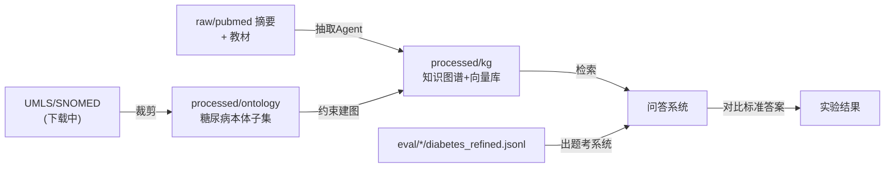

# 数据获取与数据集说明

> 配套论文：《融合本体推理的 Agentic GraphRAG 在糖尿病临床问答中的研究与实现》
> 本文档记录数据获取阶段（阶段0）的全部工作：环境搭建、数据源选择、获取流程、`data/` 目录结构与后续用法。
> 最后更新：2026-06-11

---

## 一、本阶段完成工作总览

| 类别 | 工作内容 | 状态 |
|---|---|---|
| 环境 | 安装 Miniconda，创建 `graphrag`（Python 3.11）环境并装好阶段0依赖 | ✅ |
| 骨架 | 按开题报告五大模块建立项目目录结构 + `requirements.txt` / `README` / `.gitignore` / `.env.example` | ✅ |
| 评测集 | 下载 MedQA / MedMCQA / PubMedQA 并筛出糖尿病子集 | ✅ |
| 评测集 | 编写二次精筛脚本，剔除"顺带提及糖尿病"的噪声题 | ✅ |
| 建图语料 | 编写 PubMed E-utilities 抓取脚本，抓取 2996 篇糖尿病核心文献 | ✅ |
| 额外语料 | 从 MedQA 压缩包获得 18 本英文医学教材（含哈里森内科学、Katzung 药理学） | ✅ |
| 本体知识源 | UMLS / SNOMED CT / RxNorm / ICD-10 | ⏳ 下载中 |
| 待办 | 自建"安全禁忌型"QA 集、ADA 指南、本体子集裁剪 | ❌ |

---

## 二、运行环境

### 2.1 为什么单独建 Python 3.11 环境

本机默认 Python 为 **3.14.3**，版本过新。课题核心库（`scispaCy`、`QuickUMLS`、`torch`、`faiss`、`spaCy` 等）暂无 3.14 预编译包，会安装失败。因此用 conda 单独创建 **Python 3.11** 环境（兼容性最佳）。

### 2.2 环境信息

- 包管理：Miniconda（通过 `winget install Anaconda.Miniconda3` 安装）
- conda 路径：`C:\Users\zhanghaoqing\AppData\Local\miniconda3`
- 环境名：`graphrag`，Python 3.11.15
- 环境内 Python：`C:\Users\zhanghaoqing\AppData\Local\miniconda3\envs\graphrag\python.exe`

### 2.3 激活与使用

```powershell
conda activate graphrag
python --version   # 应为 3.11.15
```

> 若 `conda` 命令在 PowerShell 中不可用，可直接用环境内 python 绝对路径执行脚本。

---

## 三、网络情况与数据源选择（重要）

获取数据时实测了网络连通性，结论直接决定了所有脚本的数据源：

| 站点 | 连通性 | 说明 |
|---|---|---|
| `huggingface.co` | ❌ 超时 | 国内不可访问 |
| `hf-mirror.com` | ❌ 失效 | 当前所有 api/resolve 请求被 308 重定向回 huggingface.co |
| **ModelScope（魔搭）** | ✅ 最快(0.6s) | 阿里旗下，国内可用 → 评测集主力源 |
| **GitHub / raw.githubusercontent** | ✅ 可用 | PubMedQA 官方标注数据 |
| **NCBI E-utilities** | ✅ 可用 | PubMed 文献抓取 |

**结论**：放弃 HuggingFace，全部改用 **ModelScope + GitHub + NCBI** 三个国内可用源。

---

## 四、数据获取流程详解

所有脚本位于 `src/data_acquisition/`。

### 4.1 评测集下载（`download_eval_datasets.py`）

**数据源（均为国内可用）：**

| 数据集 | 来源 | 形式 |
|---|---|---|
| MedQA (USMLE) | ModelScope `AI-ModelScope/med_qa` | `data_clean.zip`（含 USMLE 4 选项题 + 教材） |
| MedMCQA | ModelScope `extraordinarylab/medmcqa` | parquet（列：question/choices/answer/answer_index） |
| PubMedQA | GitHub `pubmedqa/pubmedqa` 的 `ori_pqal.json` | 官方标注版 1000 题（带 yes/no/maybe 标签） |

**运行：**

```powershell
python src/data_acquisition/download_eval_datasets.py            # 下载全部三个
python src/data_acquisition/download_eval_datasets.py --only medqa
```

**处理逻辑：** 下载 → 解析 → 用糖尿病关键词（diabetes/insulin/hba1c/retinopathy 等）一次召回 → 生成 `all.jsonl`（全量）和 `diabetes_subset.jsonl`（候选子集）。

> 说明：PubMedQA 最初尝试用 HuggingFace `datasets` 库失败（国内不通 + `datasets 5.0` 不再支持脚本式数据集），改为 GitHub 官方标注版（带 `final_decision` 标签，更适合评测）；MedMCQA 选用的清洗版 parquet 列名为 `choices` 数组，已据此适配解析。

### 4.2 评测集二次精筛（`refine_eval_subsets.py`）

**要解决的问题：** 一次关键词召回会混入"只是顺带提糖尿病"的噪声题，例如：
- 患者既往史有"2 型糖尿病"，但考点其实是泌尿系感染处理；
- 选项里含 "retinopathy"，但题目问的是其他眼科病。

**精筛逻辑：** 用"糖尿病**强相关词**"（diabet*、insulin、metformin、hba1c、glyc*、ketoacidosis、各类降糖药名、"diabetic retinopathy/nephropathy/neuropathy" 等），结合出现位置判断：

- MCQA（MedQA / MedMCQA）保留条件（满足其一）：
  1. **选项中**出现强相关词（答案围绕糖尿病 → 考点必然是糖尿病）；
  2. 题干**最后一句（真正发问句）**出现强相关词；
  3. 题干中强相关词出现 **≥ 2 次**（反复提及，多为主题）。
- PubMedQA：**研究问题本身**出现强相关词才保留（仅上下文出现不算）。

**运行：**

```powershell
python src/data_acquisition/refine_eval_subsets.py --dump-dropped
```

产出 `diabetes_refined.jsonl`（正式评测用）与 `diabetes_dropped.jsonl`（被剔除题，含 `_refine_reason`，便于人工抽检）。

> 扩展点：脚本预留了后续接入"LLM-as-judge"做更高精度筛选的空间。

### 4.3 PubMed 建图语料抓取（`fetch_pubmed.py`）

**数据源：** NCBI E-utilities（esearch + efetch）。

**检索式（默认）：** 糖尿病主干 + 主要并发症（肾病/视网膜病变/神经病变）的 MeSH 词，限定 2015 年至今、英文、有摘要。命中约 **21.3 万篇**。

**关键参数 `--sort`：**
- `relevance`（默认，**推荐**）：按相关性取，得到糖尿病**核心代表文献**（综述、机理、权威指南），年份均匀分布 2015–2026；
- `pub_date`：按最新取（会过度集中在最近几个月，缺奠基性知识，**不推荐用于建图**）。

**运行：**

```powershell
# 可选：先在 .env 填 NCBI_API_KEY（限速 3→10 请求/秒）
python src/data_acquisition/fetch_pubmed.py --max 3000 --sort relevance
```

产出 `data/raw/pubmed/diabetes_pubmed.jsonl`，每行一篇含 `pmid / title / abstract / journal / year / mesh`。当前已抓 **2996 篇**（约 6.5 MB）。

---

## 五、`data/` 目录结构与用法详解

### 5.1 顶层结构：三类数据，三种角色

```
data/
├── raw/         原始数据（下载来的，不入库，不直接喂模型）
├── processed/   加工产物（本体子集、知识图谱——后续生成）
└── eval/        评测集（问答测试用，已就绪）
```

设计原则：`raw` 是"原料仓库"，`processed` 是"半成品/成品"，`eval` 是"考卷"，三者职责分离、互不污染。

### 5.2 `data/eval/` —— 评测集（已完成）

每个数据集目录下有 4 个文件，构成"逐步提纯"链条：

| 文件 | 含义 | 用途 |
|---|---|---|
| `all.jsonl` | 该数据集**全量**题目 | 备查 / 全科对照 |
| `diabetes_subset.jsonl` | 关键词**一次召回**的候选池 | 中间产物（召回宽、有噪声） |
| `diabetes_refined.jsonl` | **二次精筛**后的糖尿病题 ⭐ | **正式评测就用这个** |
| `diabetes_dropped.jsonl` | 被精筛剔除的题（带原因） | 人工抽检、验证精筛 |

**各数据集规模（全量 → 一次召回 → 精筛）：**

| 数据集 | 全量 | 候选子集 | 精筛集 ⭐ |
|---|---|---|---|
| MedQA (USMLE) | 12,723 | 1,701 | **1,031** |
| MedMCQA | 187,005 | 5,800 | **4,193** |
| PubMedQA | 1,000 | 58 | **27** |

#### MedQA（USMLE 美国执业医师考试）

- **是什么**：美国 USMLE 风格 4 选 1 临床题，题干为真实临床情景（patient vignette）。
- **考察**：临床多跳推理（症状→诊断→处理）。是 MedGraphRAG / AMG-RAG 都报结果的**标准基准**。
- **字段**：`question`(题干)、`options`(A–D 选项字典)、`answer`(正确答案原文)、`answer_idx`(答案字母)。

```json
{"split":"...","question":"<临床情景题干>","options":{"A":"...","B":"...","C":"...","D":"..."},"answer":"<正确选项原文>","answer_idx":"A/B/C/D"}
```

#### MedMCQA（印度医学入学考题库）

- **是什么**：4 选 1 医学知识题，偏知识点记忆（情景比 MedQA 短）。
- **作用**：题量大、糖尿病子集大，使准确率统计更稳。
- **字段**：`question`、`choices`（**列表**，4 个）、`answer`(字母)、`answer_index`(下标 0–3)。

```json
{"split":"...","question":"<题干>","choices":["选项0","选项1","选项2","选项3"],"answer":"A/B/C/D","answer_index":0}
```

#### PubMedQA（基于文献摘要的问答）

- **是什么**：给一段 PubMed 摘要 + 一个研究问题，答 **yes / no / maybe**。
- **作用**：自带上下文，最贴近 RAG 场景，专门测 **忠实度 / 幻觉**。子集小，做辅助指标。
- **字段**：`pubid`、`question`、`context`(文献摘要)、`long_answer`(解释)、`final_decision`(标准答案 yes/no/maybe)。

```json
{"pubid":"<PMID>","question":"<研究型问题>","context":"<文献摘要>","long_answer":"<解释>","final_decision":"yes/no/maybe"}
```

### 5.3 `data/raw/` —— 原始数据

#### `data/raw/pubmed/diabetes_pubmed.jsonl` —— 建图语料 ⭐

- **2996 篇**糖尿病核心文献摘要（按相关性抓取，2015–2026 均匀分布）。
- **用途**：离线**建图主原料**——抽取 Agent 从摘要抽三元组建图；摘要 chunk 同时存入向量库供检索。
- 字段：`pmid / title / abstract / journal / year / mesh`。

#### `data/raw/eval_src/` —— 评测集原始下载物

- `medmcqa/*.parquet`：MedMCQA 原始 parquet。
- `medqa/data_clean.zip` 及解压目录：除 QA 外，**附带 18 本英文医学教材**（`textbooks/en/`，如 `InternalMed_Harrison.txt` 21MB、`Pharmacology_Katzung.txt`）及中文/台湾题库。
  - 💡 **额外价值**：哈里森内科学、Katzung 药理学等含大量系统化糖尿病知识，**可作为 PubMed 之外的补充建图语料**。

> `raw/` 已在 `.gitignore` 排除，不提交（体积大，且 UMLS 等受 License 约束）。

### 5.4 `data/processed/` —— 加工产物

| 子目录 | 存放 | 状态 |
|---|---|---|
| `processed/ontology/` | 糖尿病 SNOMED 本体子集、概念词典 | ✅ 已生成（见 5.5） |
| `processed/kg/` | Neo4j 节点/边文件、向量库索引 | 建图阶段（模块2–3） |

### 5.5 糖尿病 SNOMED 本体子集（已生成）

由 `src/ontology/extract_snomed_subset.py` 从 `Diabetes mellitus (SCTID:73211009)`
沿 `is-a` 递归裁剪，并纳入其定义性关系所指向的 1 跳邻居（病灶/形态/并发等）。

| 文件 | 内容 |
|---|---|
| `diabetes_concepts.csv` | 子集概念：`sctid, fsn, semantic_tag, in_core`（in_core=1 为糖尿病疾病核心） |
| `diabetes_relationships.csv` | 关系：`source/type/dest`（均含 FSN）及关系组 |
| `diabetes_subset_sctids.txt` | 子集概念 ID 列表 |

**规模**：1172 个概念（120 糖尿病疾病核心 + 453 并发症 + 599 邻居）、3371 条关系。
- 并发症通过 `Due to / Associated with / After` 指向糖尿病而纳入（如糖尿病肾病/视网膜病变/神经病变）。
- 关系类型：Is a 1385、Finding site 637、Due to 514、Associated morphology 253、Interprets 217 等。

**用法**：作为建图的"语义骨架"——抽取 Agent 抽出的三元组必须能映射到该子集的概念与关系类型，否则丢弃或标记低置信度（模块1/2）。

### 5.6 RxNorm 降糖药与用药禁忌（已生成）

由 `src/ontology/extract_rxnorm_drugs.py`（降糖药）与 `fetch_contraindications.py`（禁忌）生成。

| 文件 | 内容 | 来源 |
|---|---|---|
| `diabetes_drugs.csv` | 115 个降糖药成分：`rxcui, ingredient, atc_code, atc_class, category, brand_names` | RxNorm（ATC A10*） |
| `drug_contraindications.csv` | 218 条 `contraindicated_with` 禁忌关系：`rxcui, ingredient, ci_disease, ci_code, source` | MED-RT（RxClass API） |

- 降糖药按 ATC 类别归类：磺脲 13、DPP-4 10、SGLT2 9、GLP-1 7、TZD 4、双胍 3、α-糖苷酶抑制剂 3、胰岛素若干等；含商品名（如 metformin→Glucophage/Janumet）。
- 禁忌覆盖 61 个药，含**妊娠禁忌**（老一代磺脲、利拉鲁肽）、心衰禁忌（TZD）、肾功能不全/酸中毒/酮症酸中毒等。

**用法**：
1. 作为本体的 **Drug 节点**与 `contraindicated_with` 边，补全语义骨架；
2. 是模块4 **OWL 安全校验层**的核心公理来源（如"妊娠 + 磺脲 → 冲突"）；
3. 是**自建"安全禁忌型"QA 集**的半自动出题数据基础。

> 备注：少数复方制剂（ATC `*30`）成分名为空，不影响单药使用；商品名用于后续实体链接（病历常用商品名）。

### 5.7 统一概念词典与本体边表（已生成，模块1 收口）

由 `src/ontology/build_concept_dictionary.py` 合并 SNOMED 子集 + RxNorm 药物 + MED-RT 禁忌，
依据 `configs/relation_schema.yaml` 归入统一 schema。

| 文件 | 内容 |
|---|---|
| `configs/relation_schema.yaml` | 本体 schema：节点类型（Disease/Finding/LabTest/Drug…）+ 边类型（is_a/treats/contraindicated_with/due_to…）+ SNOMED 映射规则 |
| `concept_dictionary.csv` | 统一节点：`concept_id, source, node_type, preferred_name, category, synonyms`（含同义词/商品名，供实体链接） |
| `ontology_edges.csv` | 统一边：`source_id, source_name, edge_type, target_id, target_name, vocab` |

**规模**：384 节点（Disease 246、Drug 54、AnatomicalSite 33、Morphology 15、Qualifier 15、LabTest 7、Finding 6、Procedure 5、Substance 3）、913 条边（is_a 347、finding_site 167、contraindicated_with 107、treats 54、due_to 50 等）。

**用法**：
- 这是知识图谱的**节点/边规范层**，也是抽取 Agent 的对齐目标（schema）；
- `concept_dictionary.csv` 的 `synonyms` 字段直接供**轻量实体链接器**使用；
- `contraindicated_with` / `treats` 边是 **OWL 安全校验层**的公理来源。

### 5.8 轻量实体链接器（已实现，模块1 收口）

`src/ontology/entity_linker.py`：把文本中的医学术语链接到本体概念 ID。
基于 `concept_dictionary.csv` 的 preferred_name + synonyms 构建词典（1251 概念 / 2901 术语），
做归一化整词匹配（最长优先、不重叠），无需 UMLS / nmslib（替代 QuickUMLS）。

- 实测：`glyburide`→RXCUI、`Jardiance`(商品名)→empagliflozin、`diabetic retinopathy`→SCTID 均正确；PubMed 摘要平均 8.9 实体/篇。
- 用法：
  - 单条：`python src/ontology/entity_linker.py --text "..."`
  - 批量标注：`python src/ontology/entity_linker.py --annotate <jsonl> --limit N`
  - 库调用：`EntityLinker().link(text)`
- 作用：模块2 抽取 Agent 做"本体对齐"的基础工具（三元组实体须能链接到概念，否则丢弃/标低置信）。

### 5.9 自建"安全禁忌型"QA 集（已生成，核心创新验证集）

`src/data_acquisition/build_safety_qa.py`：基于 MED-RT 用药禁忌数据**确定性半自动生成**糖尿病
用药安全题。标准答案直接来自权威禁忌关系 → 可靠、可审计；**每题标注"违反的本体公理"**，
正好用于评测模块4 本体校验层的"禁忌违规率 / 可追溯率"。

| 文件 | 内容 |
|---|---|
| `data/eval/custom/safety_contraindication.jsonl` | 204 题：68 道四选一（选出禁忌药）+ 136 道判断题（是否恰当用药，禁忌/安全各 68 平衡），覆盖 23 种病情 |

每条字段：`id, type, subtype(mcqa_avoid/yesno), question, options, answer, answer_text, condition, drug, violated_axiom, source`。
- `violated_axiom` 形如 `contraindicated_with(Drug:chlorpropamide, Condition:Pregnancy)`，是评测时判定"答案是否违反禁忌"的依据。
- 临床抽检正确：妊娠避氯磺丙脲、甲状腺肿瘤避 semaglutide、肾功能不全不用 SGLT2、肝病可用胰岛素。
- 用法：`python src/data_acquisition/build_safety_qa.py`（确定性）；`--n-vignette N` 可另用 LLM 把题干改写成临床情景题（答案/公理不变，默认关闭）。

### 5.10 Agentic 知识图谱构建产物（模块2，进行中）

建图分两层落地为可移植图文件（`data/processed/graph/`），再可选导入 Neo4j：

| 文件 | 内容 | 生成脚本 |
|---|---|---|
| `nodes.csv` / `edges.csv` / `kg.graphml` | 知识图谱节点/边（含 `layer`=ontology/literature、`confidence`、`evidence`、`pmids`） | `build_skeleton.py` + `validate_merge.py` |
| `candidate_triples.jsonl` | LLM 从 PubMed 摘要抽出的候选三元组（含实体对齐结果） | `extract_triples.py` |
| `literature_edges.jsonl` | 通过本体校验、合并入图的文献边（带证据与置信度） | `validate_merge.py` |
| `rejected_triples.jsonl` | 被拒三元组及原因（未对齐/类型违规/冲突），供论文误差分析 | `validate_merge.py` |

流水线：① `build_skeleton` 把本体（1251节点/3448边）作为可信骨架层入图 → ② `extract_triples`
对每篇摘要先实体链接再 LLM 抽 schema 内三元组（DeepSeek-V3.2，并发）→ ③ `validate_merge`
做类型约束/自环/与骨架冲突消解 + 去重置信度打分后合并 → ④（可选）`load_neo4j` 导入 Neo4j。

**当前规模**：抽取 PubMed 相关性最高的 **500 篇**摘要 → 1808 条候选三元组 → 校验通过并入图
**329 条文献边**（另 12 条加强本体已有边），拒 1103（未对齐679/类型违规413/自环11）。
**最终图：1251 节点 / 3777 边**（本体骨架 3448 + 文献 329）。已用 `load_neo4j.py` 导入 Neo4j
（容器 `neo4j-kg`，端口 7475/7688），关系以真实类型（TREATS/CONTRAINDICATED_WITH…）呈现。

### 5.11 混合检索产物（模块3，已完成）

`src/retrieval/`：向量检索 + 图检索 + RRF 融合。

| 文件 | 内容 | 生成/使用脚本 |
|---|---|---|
| `data/processed/retrieval/pubmed.index` | 2996 篇 PubMed 摘要的 FAISS 向量索引（bge-m3，1024维，归一化内积=余弦） | `build_vector_index.py` |
| `data/processed/retrieval/pubmed_meta.jsonl` | 与索引行号对齐的元数据（pmid/title/text） | 同上 |

三个检索器：
- `vector_store.py`：查询 embedding → FAISS top-k 摘要（叙述/语义相似型问题）。
- `graph_retriever.py`：查询实体链接命中本体节点 → KG 上 1~2 跳遍历 → 事实句（多跳临床逻辑/禁忌/因果）。事实排序：跳数近 > 本体层 > 高置信。
- `hybrid.py`：并行两路 → **RRF 融合**（k=60）成统一证据上下文，每条带 provenance（PMID / layer / 置信度）。

实测 "Which antidiabetic should be avoided in pregnancy?"：图谱给出 `chlorpropamide/tolbutamide/liraglutide [contraindicated_with] Pregnancy`，向量给出妊娠期降糖治疗文献，RRF 交错融合。

### 5.12 本体推理校验层产物（模块4，核心创新，已完成）

`src/reasoning/`：把图谱转 OWL，用 HermiT 做 DL 层级推理，校验答案是否违反用药禁忌，并自纠错。

| 文件 | 内容 | 脚本 |
|---|---|---|
| `data/processed/reasoning/diabetes.owl` | OWL 本体：1251 类 + 1385 subClassOf + 109 对齐桥接 + 39 个禁忌标记类 CI_<drug> | `build_owl.py` |
| `data/processed/reasoning/owl_index.json` | concept_id↔类名映射、各药禁忌病种、桥接记录（供校验器） | 同上 |

- `validator.py`：加载 OWL → HermiT 分类（一致性=一致）→ 判断"病情类 ⊑ CI_<drug>"。具体病种经 is_a/桥接自动命中上位禁忌（如"4期糖尿病肾病" ⊑ Kidney Diseases ⊑ canagliflozin禁忌）。
- `pipeline.py`：端到端安全问答——混合检索→生成→解析推荐用药→本体禁忌校验→违规则反馈重生成（self-correction）。
- **实测拦截**：孕妇+T2DM 注入危险答案"chlorpropamide" → 本体层级推理拦截 `contraindicated_with(chlorpropamide, Pregnancy)`（来源 MED-RT）→ 重生成改为 metformin → 通过。

> 依赖：owlready2 + OpenJDK 17（conda 装在 graphrag 环境内，HermiT 用）。

### 5.13 Agentic 编排（模块5，已完成）

`src/agent/graph.py`：用 LangGraph 把模块1-4 串成端到端 Agentic 状态机。

```
START → route(问题路由: safety/factual/multihop/narrative)
      → retrieve(混合检索, 按类型调 k_vec/k_graph 权重)
      → generate(LLM 生成) → validate(本体禁忌校验)
      →[有违规且可重试] generate(带反馈重生成) ↺
      →[通过/重试用尽] END(带 provenance 输出)
```

- 路由按问题类型调检索权重（安全/多跳→图加权，叙述→向量加权）。
- 校验节点接模块4，违规则走条件边回到生成节点（self-correction 回环）。
- 实测：孕妇用药题→路由 safety→注入危险答案被层级推理拦截→重生成 metformin→通过；
  机制题→路由 narrative→向量加权→一次通过。
- 用法：`python src/agent/graph.py --q "..."`（真实）或 `--seed "危险答案"`（演示拦截回环）。

---

## 六、数据如何串起整条流水线



1. **建图（输入）**：`raw/pubmed` + 教材 → 经本体（`processed/ontology`）约束 → 生成知识图谱（`processed/kg`）。
2. **评测（考试）**：用 `eval/*/diabetes_refined.jsonl` 当考卷，让本系统与 5 个基线答题：
   - MedQA / MedMCQA → 算 **Accuracy**；
   - PubMedQA → 算 **faithfulness / 幻觉率**；
   - 后续自建**安全禁忌集** → 算 **禁忌违规率**（核心创新指标）。

---

## 七、一键复现命令清单

```powershell
conda activate graphrag

# 1) 安装依赖（首次）
pip install -r requirements.txt

# 2) 下载三个评测集并筛糖尿病子集
python src/data_acquisition/download_eval_datasets.py

# 3) 二次精筛（生成正式评测用的 diabetes_refined.jsonl）
python src/data_acquisition/refine_eval_subsets.py --dump-dropped

# 4) 抓取 PubMed 建图语料（建议先在 .env 填 NCBI_API_KEY）
python src/data_acquisition/fetch_pubmed.py --max 3000 --sort relevance
```

---

## 八、当前进度与待办

| 数据 | 状态 |
|---|---|
| 三个公开评测集（含精筛集） | ✅ 完成 |
| PubMed 建图语料 2996 篇 | ✅ 完成 |
| 18 本医学教材（额外语料） | ✅ 已获得 |
| SNOMED CT / RxNorm 下载并解压 | ✅ 完成 |
| 糖尿病 SNOMED 本体子集（1172 概念/3371 关系，含并发症） | ✅ 完成 |
| UMLS Full Release | ⏸️ 已下载，暂缓解压（实体链接阶段再跑 MetamorphoSys，仅装 SNOMEDCT_US/RXNORM/ICD10CM） |
| RxNorm 降糖药/禁忌关系抽取 | ✅ 完成（115药/218禁忌，已并入概念词典） |
| 统一概念词典 + 实体链接器 | ✅ 完成（1251节点/3448边，模块1收口） |
| 自建"安全禁忌型"QA 集 | ✅ 完成（204题，核心创新验证集） |
| Agentic 建图（骨架+文献抽取+本体校验） | ✅ 完成（500篇抽取，329条文献边并图） |
| 模块3 混合检索（FAISS向量+图遍历+RRF） | ✅ 完成 |
| 模块4 OWL 校验层（HermiT 层级推理+自纠错） | ✅ 完成 |
| 模块5 LangGraph Agentic 端到端编排 | ✅ 完成 |
| 模块6 实验评测框架 + 主实验 | ✅ 完成（见第九节） |
| ADA 指南 / 中国糖尿病防治指南 | ❌ 待获取（论文写作时引用） |

**下一步建议：** 进入论文撰写（系统设计五模块 + 实验章节，实验数据见第九节）。

---

## 九、模块6：实验评测框架与结果

### 9.1 框架结构（`src/eval/`）

| 文件 | 作用 |
|---|---|
| `common.py` | 4 个评测集归一化加载（MCQA/Yes-No 两种题型）+ 选项/答案解析 + 指标 |
| `methods.py` | 5 种方法统一接口：`llm` / `vector` / `graph` / `hybrid` / `full`（本方法） |
| `run.py` | 统一入口：`--task mcqa\|yesno\|safety`，并发跑批、存明细、打印汇总表 |
| `enrich_safety.py` | 多维度评测：违规率+可追溯+概念覆盖(实体链接)+临床适宜性(LLM-as-judge 1-5) |

结果存于 `data/eval/results/*.json`（逐题明细可复现/做误差分析）。

**5 方法即消融：** full(混合+OWL校验+纠错) vs hybrid(无校验) = **OWL 校验增益**；hybrid vs graph/vector = 融合增益；vs llm = 检索增益。

### 9.2 核心结果：禁忌违规率（论文主创新）

23 个"病情+糖尿病"开放推药题，问模型推荐降糖药，用本体校验器做 oracle 判断是否推荐了禁忌药：

| 方法 | 禁忌违规率↓ | 可追溯率↑ |
|---|---|---|
| 纯 LLM | 8.7% | 0% |
| 向量 RAG | 4.3% | 100% |
| 图 RAG | 13.0% | 100% |
| 混合(无校验) | 4.3% | 100% |
| **本方法 full** | **0.0%** | **100%** |

**多维度补充**（`enrich_safety.py`，借鉴 JMIR GraphRAG 论文的多指标框架）：

| 方法 | 违规率↓ | 可追溯↑ | 概念覆盖 | 临床适宜性(1-5)↑ |
|---|---|---|---|---|
| 纯 LLM | 8.7% | 0% | 6.17 | 4.43 |
| 向量 RAG | 4.3% | 100% | 4.78 | 4.04 |
| 图 RAG | 0% | 100% | 11.17 | 3.78 |
| 混合 | 8.7% | 100% | 7.35 | 4.17 |
| **本方法** | **0%** | 100% | 5.78 | **4.39** |

→ 本方法在保持接近最优临床适宜性(4.39)的同时违规率为0,是安全与质量的最佳平衡;图RAG概念覆盖最高但适宜性最低(堆砌事实)。注:违规率有采样波动,本方法两次运行均为0%。

**典型拦截案例**（基线违规、本方法规避）：
- 肝病 → 误荐 **吡格列酮**（`contraindicated_with(pioglitazone, Liver Diseases)`）
- 肾病/慢性肾衰 → 误荐 **恩格列净/卡格列净**（SGLT2i 肾功能受限）
- 甲状腺肿瘤 → 误荐 **司美格鲁肽/度拉糖肽**（GLP-1 类，甲状腺髓样癌风险）

### 9.3 准确率（消融视角）

| 数据集(题数) | llm | vector | graph | hybrid |
|---|---|---|---|---|
| 安全选择题(108) | 56.5% | 44.4% | **69.4%** | 62.0% |
| 安全判断题(40) | 37.5% | 25.0% | **45.0%** | 42.5% |
| MedQA(40) | **80.0%** | 72.5% | 67.5% | 62.5% |
| PubMedQA(27) | **59.3%** | 51.9% | 48.1% | 37.0% |

**解读：** 安全/禁忌类题上知识图谱检索(graph/hybrid)明显优于纯 LLM（KG 含权威禁忌知识）；
通用医考题(MedQA/PubMedQA)检索引入噪声、不及 LLM 参数知识——诚实负向发现，
印证本系统定位是**安全攸关的临床用药问答**，而非通用医考刷分。

### 9.4 复现命令

```powershell
# 核心：禁忌违规率（全部 23 病情 × 5 方法）
python -m src.eval.run --task safety --limit 0 --methods llm,vector,graph,hybrid,full

# 准确率
python -m src.eval.run --task mcqa  --data safety_mcqa --limit 0 --methods llm,vector,graph,hybrid
python -m src.eval.run --task mcqa  --data medqa       --limit 40
python -m src.eval.run --task yesno --data pubmedqa    --limit 0
python -m src.eval.run --task yesno --data safety_yesno --limit 40
```
