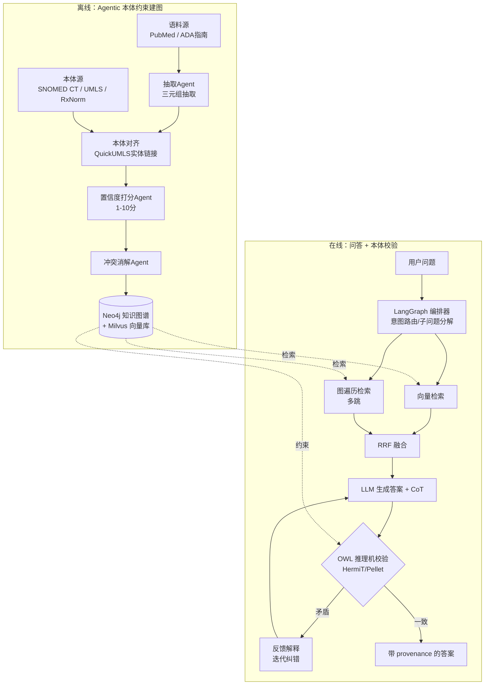

## 用户

<timestamp>Wednesday, Jun 10, 2026, 10:57 AM (UTC+8)</timestamp>
<user_query>
现在我要进行毕业论文的选题，目前的方向是医学领域的graphRAG，但是整个医学领域太大了，是否能聚焦某个小领域（比如糖尿病，胃病，儿科之类的），另外graphRAG已经好几年了，融合一下本体，agentic grapgRAG,是否可行，本体融入人工智能应用中，是否有相关参考文献推荐阅读，或相关参考项目
</user_query>

## 助手

这是个很好的研究方向问题。让我先搜索一些最新的相关文献和项目，确保给你的建议是基于当前研究前沿的。

 用户在用中文提问关于论文选题的问题。他想了解在医学领域应用GraphRAG的可行性，比如选择糖尿病、胃病或儿科等具体子领域，同时想确认GraphRAG结合本体论和智能体方法是否已经成熟可行。

现在我需要搜索相关的最新文献和项目案例来为他提供参考资源。
[工具调用: WebSearch]
[工具调用: WebSearch]

## 助手

让我再搜索一下本体（ontology）与AI/LLM融合的核心文献和综述。

 I should search for more references on how ontologies are being used in LLM applications and AI systems to provide better sources for this topic.
[工具调用: WebSearch]
[工具调用: WebSearch]

## 助手

先给结论：**你的思路完全可行，而且正好踩在 2025–2026 年的研究前沿上。** "本体（ontology）+ agentic GraphRAG + 聚焦某一具体疾病" 这三者结合，目前还没有形成成熟范式，留给毕业论文的创新空间很大。下面我分四块帮你理清楚。

---

## 一、为什么"聚焦小领域"是对的

医学领域整体太大，作为毕业论文几乎无法做实验闭环（语料、本体、评测都失控）。聚焦能带来三个直接好处：有现成的标准本体可用、有公开数据集、评测边界清晰。从可行性角度，几个值得考虑的小切口：

- **妊娠期糖尿病（GDM）/ 2型糖尿病**：已有 2026 年的概念验证论文（JMIR Diabetes），用 1212 篇 PubMed 文献 + Neo4j 建图做本地 LLM 临床决策支持。糖尿病是慢病、有清晰的诊疗指南、并发症轨迹明确，**特别适合做"本体约束 + 时序知识图谱"**。
- **罕见病 / 遗传病**：有 HPO（Human Phenotype Ontology）这种高质量本体，且 LLM 训练语料覆盖弱——研究表明本体接地的价值在"模型训练数据覆盖最弱"的地方最大，反而容易做出显著提升。
- **儿科**：本体相对稀疏、用药/剂量与成人差异大，安全性约束需求强，适合突出"本体做逻辑校验、防幻觉"的卖点。

我的建议：**优先糖尿病（尤其 GDM 或并发症轨迹方向）**，因为本体、数据、baseline 论文都齐全，毕业论文最容易跑通闭环。

---

## 二、"本体 + Agentic GraphRAG"的技术可行性与论文创新点

把三个层次叠起来，正好对应一条清晰的技术主线：

1. **本体层（Symbolic backbone）**：用 SNOMED CT / UMLS / ICD-10 / HPO 作为图的语义骨架。所有 LLM 抽取的实体、关系都映射到标准术语，解决同义词/多义词（如 "MS" = 多发性硬化 or 二尖瓣狭窄）。
2. **GraphRAG 检索层**：向量检索（非结构化叙述）+ 图遍历（多跳临床逻辑），用 RRF（Reciprocal Rank Fusion）融合。
3. **Agentic 编排层**：用 LangGraph 等做"意图路由 → 子查询分解 → 并行检索 → 置信度打分 → 综合作答"，并让 agent 自主增量更新图谱。

**论文的差异化创新点**（这是关键，避免只是复现）可以放在：

- **本体作为"逻辑校验器"而非仅仅是 schema**：用 OWL + 描述逻辑推理机（HermiT / Pellet）对 LLM 输出做一致性检查，发现 RAG 抓不到的逻辑矛盾，再迭代反馈纠错。这是 RAG 之外的额外幻觉防线，目前融合到 agentic GraphRAG 的工作还很少。
- **本体约束的图构建**：agent 抽取三元组时强制对齐本体 schema，提升图质量和可审计性。
- **时序/轨迹建模**：针对糖尿病并发症进展，做 temporal knowledge graph。

---

## 三、推荐精读的参考文献（按角色分类）

**核心 baseline（必读）**
- *Medical Graph RAG (MedGraphRAG)*, arXiv:2408.04187 — 医学 GraphRAG 的奠基工作，提出 Triple Graph Construction 和 U-Retrieval，把数据链接到权威医学论文和词典。**这是你最直接的对照基线。**
- *Agentic Medical Knowledge Graphs (AMG-RAG)*, EMNLP 2025 Findings / arXiv:2502.13010 — "Agentic + 医学 KG"的代表作，自动建图、置信度打分、provenance 追踪，MEDQA 上 F1 74.1。**这是你"agentic"部分的标杆。**
- *KG4Diagnosis*, arXiv:2412.16833 — 层级多智能体 + KG 增强诊断，明确讨论了 SNOMED-CT/UMLS 与 LLM 抽取的混合方案。

**本体 + 神经符号融合（你的创新理论支撑）**
- *Neuro-Symbolic AI: Towards Improving the Reasoning Abilities of LLMs*, IJCAI 2025 Survey（Yang et al.）— 提出 Symbolic→LLM / LLM→Symbolic / LLM+Symbolic 三分类，配套 GitHub 资源库 `Awesome-LLM-Reasoning-with-NeSy`。**做综述章节必引。**
- *Enhancing LLMs through Neuro-Symbolic Integration and Ontological Reasoning*, arXiv:2504.07640 — 用 OWL + HermiT 做一致性校验和迭代纠错，**直接对应你"本体当校验器"的创新点。**
- *Ontology-Constrained Neural Reasoning in Enterprise Agentic Systems*, arXiv:2604.00555 — 本体约束的 agentic 系统三层架构，并指出"本体接地在 LLM 训练弱覆盖处价值最大"（支撑你选罕见病/细分领域的论证）。

**聚焦糖尿病的应用范例**
- *GraphRAG-Enabled Local LLM for Gestational Diabetes Mellitus*, JMIR Diabetes 2026 / medRxiv 2025.04.28.25326568 — 最贴近你选题的工作，含完整方法（Semantic Scholar API + 实体抽取 + Neo4j + 5 个 NLG 指标评测）。
- *Mapping Diabetes Trajectories with Temporal KG & GraphRAG*（Medium 工程博客）— 时序图谱建并发症轨迹的实现思路。

**临床落地 / 可审计性（讨论章节用）**
- *An auditable and source-verified framework for clinical AI decision support*, Frontiers in AI 2026 — SNOMED-CT/UMLS 做实体链接 + provenance 的工程架构。
- *ReinRAG (Leaps Beyond the Seen)*, OpenReview — 用 UMLS KG + 强化学习检索推理路径生成临床文本，MIMIC-IV-Note 数据集。

---

## 四、推荐参考项目 / 代码

- **AMG-RAG**：`github.com/MrRezaeiUofT/AMG-RAG` — agentic 医学图谱 + PubMed/Wikipedia 检索 + Neo4j，有完整代码，**最适合作为起点改造**。
- **Awesome-LLM-Reasoning-with-NeSy**：`github.com/LAMDASZ-ML/Awesome-LLM-Reasoning-with-NeSy` — 神经符号推理论文/资源合集。
- **MedGraphRAG**：官方有开源实现（搜 SuperMedIntel/Medical-Graph-RAG）。
- 技术栈参考：**Neo4j**（图存储）+ **Milvus/FAISS**（向量）+ **LangGraph**（agentic 编排）+ **FastMCP**（把 GraphRAG 暴露为 agent 的统一记忆层）。

---

## 一个可落地的选题表述（供参考）

> **"融合本体推理的 Agentic GraphRAG 在糖尿病临床问答中的研究与实现"** —— 以 SNOMED CT/UMLS 本体为语义骨架，结合多智能体自主图谱构建与混合检索，并引入 OWL 描述逻辑推理机做输出一致性校验，在糖尿病（或 GDM）问答数据集上对比 MedGraphRAG / AMG-RAG，验证幻觉率、准确率与可审计性的提升。

这个表述同时覆盖了你提到的三个关键词（聚焦疾病 + 本体 + agentic GraphRAG），且有明确的 baseline 和评测口径。

---

要不要我帮你进一步做这几件事中的一项？比如把上面的文献整理成一份可视化的"选题调研报告"画布、起草开题报告/技术路线图、或者梳理糖尿病方向可用的公开数据集和评测指标清单。你也可以告诉我倾向哪个细分疾病，我再帮你把创新点和实验方案细化。

 现在我有足够的材料来给出一个全面的论文选题建议。我会从可行性评估开始，然后推荐几个有前景的细分领域，接着介绍本体与智能体GraphRAG的技术框架，最后整理相关文献和参考项目。

用文本形式呈现会更清晰，不需要表格。

## 用户

<timestamp>Wednesday, Jun 10, 2026, 11:43 AM (UTC+8)</timestamp>
<user_query>
再详细说明一下"融合本体推理的 Agentic GraphRAG 在糖尿病临床问答中的研究与实现" —— 以 SNOMED CT/UMLS 本体为语义骨架，结合多智能体自主图谱构建与混合检索，并引入 OWL 描述逻辑推理机做输出一致性校验，在糖尿病（或 GDM）问答数据集上对比 MedGraphRAG / AMG-RAG，验证幻觉率、准确率与可审计性的提升。，这个选题具体要做些什么，数据集是什么，模型图，预计结果
</user_query>

## 助手

下面把这个选题"拆解到可执行颗粒度"，分成：要做什么（5 个模块）、数据从哪来、系统架构图、评测怎么做、预计结果，最后给一个工作量排期。

---

## 一、整个系统要做的 5 个模块

可以把论文的工程部分理解为一条流水线，分**离线建图**和**在线问答**两段。

### 模块 1：本体对齐层（语义骨架）
这是你区别于普通 GraphRAG 的第一个支点。

- 选定本体：糖尿病方向用 **SNOMED CT**（疾病/症状/操作）+ **UMLS**（跨术语映射）+ 可选 **ICD-10**（并发症编码）+ **RxNorm**（降糖药）。
- 做的事：用 **QuickUMLS / scispaCy / MetaMap** 把文本里的实体链接到标准概念 ID（如"低血糖"→ SNOMED 302866003）。
- 产出：一个"概念词典 + 关系模板"，规定图里允许出现哪些节点类型（Disease/Symptom/Drug/LabTest/Complication）和哪些边类型（causes / treats / symptom_of / contraindicated_with / progresses_to）。

### 模块 2：多智能体自主图谱构建（Agentic KG Construction）
对标 AMG-RAG，但加上"本体约束"。

- **抽取 Agent**：从语料抽三元组，但抽出的实体/关系必须能映射到模块 1 的本体 schema，否则丢弃或标记低置信度。
- **置信度打分 Agent**：给每条边打 1–10 分（参考 AMG-RAG），分数低的边在检索时降权。
- **冲突消解 Agent**：同一关系来自多篇文献冲突时做仲裁。
- **更新 Agent**：增量把新 PubMed 文献并入图，不重建全图。
- 存储：**Neo4j**。

### 模块 3：混合检索（Hybrid Retrieval）
- **向量检索**：把文献 chunk 存 **Milvus/FAISS**，做语义召回（处理叙述性问题）。
- **图遍历检索**：把问题实体映射到图上做多跳遍历（处理"糖尿病 + 高血脂下一步怎么治"这类多跳临床逻辑）。
- **融合**：用 **RRF（Reciprocal Rank Fusion）** 把两路结果合并排序。

### 模块 4：本体推理校验层（你最大的创新点 ⭐）
这是和 MedGraphRAG / AMG-RAG 拉开差距的关键，目前融进 agentic GraphRAG 的工作很少。

- LLM 生成答案后，用一个 **NL→逻辑形式** 的桥接模块（可用小模型/规则）把答案里的关键论断转成 OWL 公理。
- 用 **HermiT / Pellet / ELK** 描述逻辑推理机检查答案是否与本体约束矛盾（例如答案推荐了一个对孕妇禁忌的降糖药 → 触发 `contraindicated_with` 冲突）。
- 若发现矛盾 → 把矛盾解释反馈给 LLM，迭代重新生成（self-correction loop）。
- 这一层让你能宣称：**"在 RAG 之外提供了一道逻辑级幻觉防线，且每个结论可追溯到本体公理"**（可审计性）。

### 模块 5：Agentic 编排（把上面串起来）
用 **LangGraph** 做状态机：意图路由 → 子问题分解 → 并行检索 → 答案生成 → 本体校验 → （若失败）回环纠错 → 输出带 provenance 的最终答案。

---

## 二、数据集（这块要提前确认，是论文最大风险点）

医学领域**没有现成的"糖尿病专用 QA benchmark"**，所以策略是"通用集筛子集 + 自建专科集"两条腿走路。诚实地说，这部分需要你自己构建一部分。

**(1) 本体/知识源（建图用，免费可申请）**
- SNOMED CT（UMLS 账号免费申请 UMLS License）、UMLS Metathesaurus、RxNorm、ICD-10。
- 语料：**PubMed/PMC** 糖尿病相关文献（通过 E-utilities/Semantic Scholar API 检索）、**ADA Standards of Care**（美国糖尿病协会年度诊疗指南，权威且结构化）、中国《糖尿病防治指南》。

**(2) 评测数据集（问答用）**
- **MedQA (USMLE)**、**MedMCQA**、**PubMedQA** —— 从中**筛选内分泌/糖尿病相关题目**构成专科子集（这是最常见做法，AMG-RAG 也用 MedQA）。
- **MMLU 的 clinical/医学子集**做补充。
- **自建糖尿病 QA 集**：从 ADA 指南 + PubMed 自动生成 + 人工校验问答对（GDM 那篇 JMIR 论文就是这么做的，约千篇文献规模即可）。建议规模 300–800 题，分"事实型/多跳推理型/安全禁忌型"三类，其中"安全禁忌型"专门用来验证你的本体校验层。
- 临床文本生成方向可选 **MIMIC-IV-Note**（需 PhysioNet 认证）。

**(3) 患者轨迹（可选，做时序图谱才需要）**
- 合成患者数据（Synthea 可生成糖尿病并发症轨迹），避免隐私问题。

> 现实建议：本科/硕士毕设，**主力用 MedQA/MedMCQA 的糖尿病子集 + 一个 300 题左右的自建安全禁忌集** 就足够支撑实验，不必碰需要伦理审批的真实 EHR。

---

## 三、系统架构图

核心信息流：**本体既参与"建图约束"（左），又参与"输出校验"（右下）——这种"双重接地"就是你论文的卖点。**

---

## 四、评测怎么做（指标 + 对照）

**对照组（baseline）**
1. 纯 LLM（如 Llama-3 / Qwen，闭源可加 GPT-4o）
2. 普通向量 RAG
3. **MedGraphRAG**（图 RAG 基线）
4. **AMG-RAG**（agentic 图 RAG 基线）
5. **你的方法**（+ 本体约束 + OWL 校验）

**指标**
- **准确率**：MCQA 用 Accuracy / Exact Match；开放问答用 F1、ROUGE、BERTScore。
- **幻觉率**：用 SNOMED CT 概念级匹配 + 人工/LLM-as-judge 标注事实错误率；可参考 RAGAS（faithfulness、answer relevance）。
- **可审计性**：可追溯率（答案结论能映射到图路径/本体公理的比例）、引用正确率。
- **安全性**：在"禁忌型"子集上的违规推荐率（这块最能体现 OWL 校验价值）。
- **消融实验**：去掉本体对齐 / 去掉 OWL 校验 / 去掉图检索，分别看指标掉多少——这是论文的核心论证。

---

## 五、预计结果（用于开题"预期成果"，非真实数据）

基于 MedGraphRAG（2408.04187）、AMG-RAG（MedQA F1≈74）等已发表数值，合理的预期区间：

| 方法 | 准确率 | 事实幻觉率 | 禁忌违规率 | 可追溯率 |
|---|---|---|---|---|
| 纯 LLM | 基准 | 高 | 高 | ~0 |
| 向量 RAG | +5~8% | 中 | 中高 | 低 |
| MedGraphRAG | +10~15% | 中低 | 中 | 中 |
| AMG-RAG | +12~18% | 低 | 中 | 中高 |
| **本方法** | **+2~5%（相对最佳基线）** | **最低** | **显著下降** | **最高** |

预期能讲的故事：**准确率相对最强 baseline 再小幅提升，但"幻觉率"和"禁忌违规率"会因为 OWL 校验层而明显下降，"可审计性"显著领先**——也就是说论文的主要贡献不是"更准一点点"，而是"更安全、更可信、可解释"。这对医学场景是更有说服力的卖点，答辩时也更稳。

---

## 六、工作量排期（约 4–5 个月）

1. **第 1 月**：申请 UMLS License，跑通 MedGraphRAG / AMG-RAG 两个 baseline（复现是后面对比的前提）。
2. **第 2 月**：本体对齐层 + Neo4j 建图，构建糖尿病子集语料。
3. **第 3 月**：混合检索 + LangGraph 编排打通端到端。
4. **第 4 月**：⭐ OWL 校验层 + 纠错回环（创新核心，预留充足时间）。
5. **第 5 月**：自建评测集、跑全部实验 + 消融、写论文。

**最大风险点**提前提示你：（1）UMLS/SNOMED 申请要时间，**第一周就去申请**；（2）NL→OWL 公理的自动转换很难做全自动，建议**限定在"用药禁忌/并发症进展"几类关系上做半自动**，别想覆盖所有论断，否则做不完。

---

需要我接着帮你做哪一步？可选：起草完整的**开题报告**（含研究背景/国内外现状/技术路线/创新点）、列一份**糖尿病本体与数据集的具体获取清单+申请链接**、或者把上面架构落成一个**最小可运行的代码骨架**（Neo4j + LangGraph + 检索）。你也可以先告诉我做"普通2型糖尿病"还是"GDM 妊娠糖尿病"，我帮你把禁忌型评测集的设计再细化。

 用户需要一个详细的论文主题分解，包括具体的实施步骤、数据集、模型架构和预期结果。我应该用中文提供清晰的架构说明，并考虑创建一个模型图来可视化设计。

对于糖尿病特定的数据集，我需要诚实地指出没有现成的标准基准，用户可能需要从ADA指南、PubMed和现有医学QA数据集中构建自己的子集。我会组织成几个部分：研究内容拆解、数据集来源、模型架构图、评测指标和预期结果。

## 用户

[Image]
<image_files>
The following images were provided by the user and saved to the workspace for future use:
1. C:\Users\zhanghaoqing\.cursor\projects\d-token-graphRAG-paper/assets/c__Users_zhanghaoqing_AppData_Roaming_Cursor_User_workspaceStorage_19db2028b982b94fb71e7bfe8a5d305d_images_image-14824718-e7f6-426f-8bf1-31abc5be1368.png

These images can be copied for use in other locations.
</image_files>
<timestamp>Wednesday, Jun 10, 2026, 11:52 AM (UTC+8)</timestamp>
<user_query>
先解决一下数据集问题，SNOMED CT这个网站能或得什么数据集，
</user_query>

## 助手

我看到你打开的是 NLM 的 SNOMED CT 页面。先纠正一个关键认知，再逐项说明这个网站能下到什么。

## 一个重要区分（先看这个）

**SNOMED CT 不是"问答数据集"，它是"术语本体/知识骨架"。** 在你的项目里它扮演两个角色：
1. 模块 1 的**本体语义骨架**（节点类型、概念 ID、层级关系）
2. 模块 4 的**逻辑校验约束来源**

它**不能直接拿来当评测题库**。评测用的 MedQA/自建糖尿病 QA 集要另外搞（上一条回复里讲过）。所以这个网站解决的是"知识图谱骨架"问题，不是"评测"问题。

---

## 这个页面能下载的东西（逐项说明）

从你截图的 **Download SNOMED CT** 展开列表看：

**对你项目最有用的（建议下载）**
- **US Edition of SNOMED CT** / **International Release of SNOMED CT**：核心发布包。这是 SNOMED CT 主体——包含全部概念（Concepts）、描述（Descriptions，即术语名称/同义词）、关系（Relationships，即 `is-a`、`finding-site`、`causative-agent` 等）。**这就是你建本体图谱的原材料**。International 版概念更全，US 版含美国扩展。糖尿病项目用哪个都行，建议 International Edition。
- **SNOMED CT to ICD-10-CM Map**：SNOMED 概念到 ICD-10 编码的映射表。做并发症编码、跨术语对齐时有用。
- **Additional SNOMED CT Mapping Files**：到其他术语体系的映射（如 ICD-O 等）。
- **CORE Problem List Subset**：临床最常用问题/诊断的精选子集。**如果你嫌完整版太大（35 万+概念），这个精简子集很适合做毕设原型**，覆盖高频临床概念。

**用处不大的（可跳过）**
- **Convergent Medical Terminology (CMT) Subsets**、**Nursing Problem List Subset**、**Nursing Resources**：护理/特定场景子集，和糖尿病临床问答关系不大。
- **Global Patient Set**：免费的简化患者级子集（不需要完整 license 也能用），但内容有限，研究价值不如完整 Release。

---

## 关键前提：必须先拿 License

页面右侧 **Get a License** 区域很重要：**下载完整 SNOMED CT Release 需要先注册 UMLS License（免费，但要审批）**。

- 注册入口：UMLS Terminology Services（uts.nlm.nih.gov），用机构邮箱申请，通常几天到 1–2 周批下来。
- 拿到 UMLS 账号后，**不仅能下 SNOMED CT，还能一并下载 UMLS Metathesaurus 和 RxNorm**——这正好覆盖你项目需要的全部本体源。
- 这是你排期里的**第一周就要做的事**，否则后面全卡住。

---

## 文件拿到后长什么样（RF2 格式）

SNOMED CT 下载下来是 **RF2（Release Format 2）** 的一堆 tab 分隔文本文件，核心三张表：

- `sct2_Concept_*.txt` —— 概念（每个概念一个 ID + 是否激活）
- `sct2_Description_*.txt` —— 术语名称和同义词（实体链接靠它）
- `sct2_Relationship_*.txt` —— 概念间关系（建图的边靠它）

解析工具推荐：**Snowstorm**（官方 SNOMED 术语服务器，可本地起 Neo4j-like 查询）、**PyMedTermino2** 或 **owlready2**（能把 SNOMED 转成 OWL，正好接你的 HermiT 推理校验层）。

---

## 给你的下一步建议

针对糖尿病选题，完整 35 万概念用不上，建议这样裁剪：

1. 先申请 UMLS License。
2. 下载 **International Edition**（或先用 **CORE Problem List Subset** 做原型）。
3. 从糖尿病顶层概念（如 `Diabetes mellitus` SCTID:73211009）出发，用 `is-a` 关系**向下递归抽取子树** + 关联的症状/并发症/用药概念，裁出一个"糖尿病专科本体子集"（几千个概念量级），这才是你实际建图要用的。

要不要我帮你写一个**从 RF2 文件抽取糖尿病子树并导入 Neo4j 的 Python 脚本骨架**？或者先帮你列一份**完整的数据获取清单**（SNOMED + UMLS + RxNorm + PubMed + 评测集，含申请链接和预计耗时）？

 Looking at the screenshot from the SNOMED CT page, I can see the main download options available: the US Edition of SNOMED CT and the International Release. Let me walk through what datasets are accessible from this site.

Beyond the core editions, there are several specialized mapping files and subsets available—including mappings to ICD-10-CM, additional SNOMED CT mapping files, the CORE Problem List Subset, Convergent Medical Terminology Subsets, Nursing Problem List Subset, and the Global Patient Set. There's also licensing information, educational resources about SNOMED CT, and a way to request new content be added to the terminology.

I should clarify an important distinction: SNOMED CT is a terminology and ontology that provides the concept hierarchy and relationships between medical terms—it's the knowledge backbone for understanding how concepts connect. It's not a dataset for evaluation or question-answering tasks. For the diabetes GraphRAG project, this gives us the structured medical knowledge we need, but we'd still need separate evaluation data to test the system's performance.
