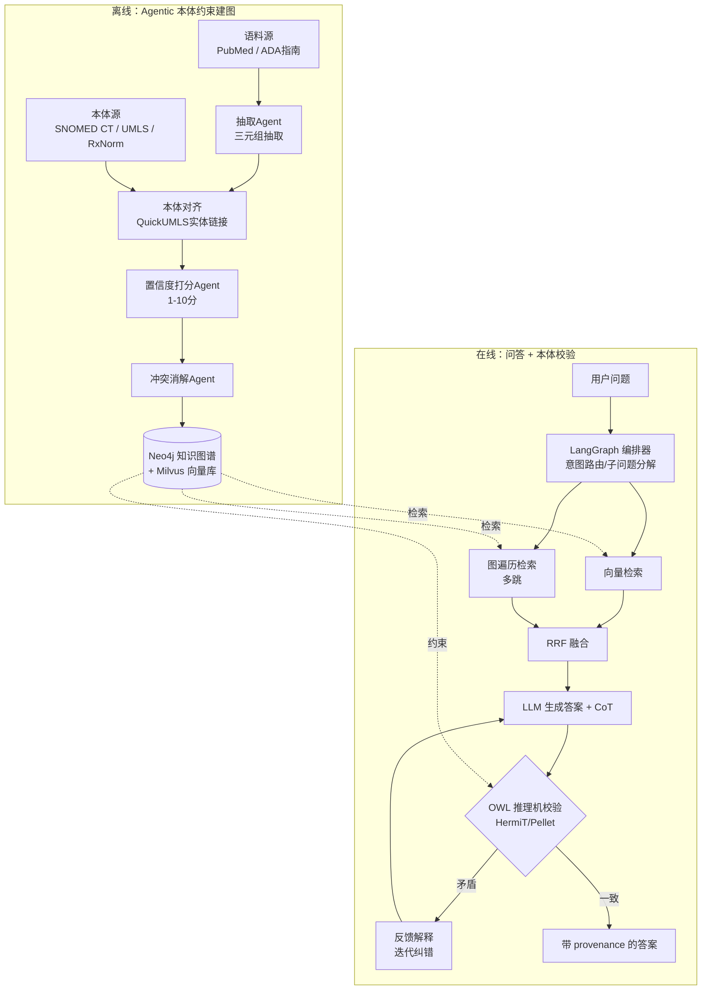

# 毕业论文开题报告

**论文题目：** 融合本体推理的 Agentic GraphRAG 在糖尿病临床问答中的研究与实现

**英文题目：** Ontology-Reasoning-Enhanced Agentic GraphRAG for Clinical Question Answering in Diabetes

---

## 一、选题背景与研究意义

### 1.1 研究背景

大语言模型（LLM）在医学问答、临床决策支持等任务中展现出巨大潜力，但其固有的"幻觉"问题、知识时效性不足以及推理过程不可解释，严重制约了其在高风险医疗场景中的落地。检索增强生成（Retrieval-Augmented Generation, RAG）通过引入外部知识缓解了部分问题，而图检索增强生成（GraphRAG）进一步利用知识图谱的结构化关系，支持多跳临床逻辑推理，成为近两年的研究热点。

然而，当前医学 GraphRAG 仍存在三方面不足：

1. **知识表示缺乏语义约束**：从文本自动抽取的三元组质量参差不齐，实体歧义（如 "MS" 既可指多发性硬化也可指二尖瓣狭窄）和关系冲突普遍存在，缺乏权威术语本体的约束。
2. **缺乏逻辑级幻觉防线**：RAG 只能保证"检索到的内容相关"，无法判断生成答案是否违反医学逻辑（如推荐了对孕妇禁忌的药物），仍可能产生看似合理实则错误甚至危险的回答。
3. **可审计性弱**：答案难以追溯到权威知识来源与推理依据，不满足医疗场景对可解释、可问责的要求。

与此同时，本体（Ontology）作为符号化的知识表示，配合描述逻辑推理机可进行严格的一致性校验；智能体（Agentic）方法可实现自主的知识图谱构建与多步推理编排。将"本体推理"与"Agentic GraphRAG"相结合，正成为神经符号融合（Neuro-Symbolic AI）领域 2025–2026 年的研究前沿，目前尚未形成成熟范式，具有较大的创新空间。

### 1.2 选题聚焦：为何选择糖尿病领域

整个医学领域过于庞大，作为毕业论文难以形成"语料—本体—评测"的完整实验闭环。本课题聚焦**糖尿病**这一具体疾病领域，理由如下：

- **本体资源齐全**：SNOMED CT、UMLS、ICD-10、RxNorm 等权威术语体系对糖尿病及其并发症、用药均有完善覆盖；
- **诊疗逻辑清晰**：糖尿病为慢性病，具有明确的诊疗指南（如 ADA Standards of Care）和并发症进展轨迹，便于建模"本体约束 + 时序知识图谱"；
- **有可对照的前沿工作**：已有 2026 年针对妊娠期糖尿病（GDM）的 GraphRAG 概念验证论文（JMIR Diabetes），可作为直接对照基线；
- **安全约束需求强**：用药禁忌（尤其妊娠期）、并发症联用等场景，恰好能凸显本体逻辑校验层的价值。

### 1.3 研究意义

- **理论意义**：探索"本体双重接地"（建图约束 + 输出校验）机制，丰富神经符号融合与可信医学 AI 的方法论。
- **应用意义**：构建一个准确、安全、可审计的糖尿病临床问答原型系统，为 LLM 在专科医疗场景的可信落地提供可借鉴的工程范式。

---

## 二、国内外研究现状

### 2.1 医学 GraphRAG

- **MedGraphRAG**（arXiv:2408.04187）提出三元组图构建（Triple Graph Construction）与 U-Retrieval，将数据链接到权威医学论文与词典，是医学 GraphRAG 的奠基性工作，也是本课题最直接的对照基线。
- **KG4Diagnosis**（arXiv:2412.16833）采用层级多智能体结合知识图谱增强诊断，明确讨论了 SNOMED-CT/UMLS 与 LLM 抽取相结合的混合方案。

### 2.2 Agentic 知识图谱与问答

- **AMG-RAG（Agentic Medical Knowledge Graphs）**（EMNLP 2025 Findings / arXiv:2502.13010）实现了自动建图、边置信度打分与来源（provenance）追踪，在 MEDQA 上达到 F1 74.1，是"Agentic + 医学 KG"方向的代表性工作，也是本课题 Agentic 部分的标杆基线。
- **ReinRAG**（OpenReview）利用 UMLS 知识图谱与强化学习生成检索推理路径，应用于 MIMIC-IV-Note 临床文本生成。

### 2.3 本体与神经符号融合

- **Neuro-Symbolic AI: Towards Improving the Reasoning Abilities of LLMs**（IJCAI 2025 Survey, Yang et al.）提出 Symbolic→LLM / LLM→Symbolic / LLM+Symbolic 三类融合范式，并维护资源库 `Awesome-LLM-Reasoning-with-NeSy`。
- **Enhancing LLMs through Neuro-Symbolic Integration and Ontological Reasoning**（arXiv:2504.07640）利用 OWL + HermiT 推理机进行一致性校验与迭代纠错，直接支撑本课题"本体作为校验器"的创新点。
- **Ontology-Constrained Neural Reasoning in Enterprise Agentic Systems**（arXiv:2604.00555）给出本体约束 agentic 系统的三层架构，并指出"本体接地在 LLM 训练数据覆盖最弱处价值最大"。

### 2.4 糖尿病领域应用

- **GraphRAG-Enabled Local LLM for Gestational Diabetes Mellitus**（JMIR Diabetes 2026 / medRxiv 2025.04.28.25326568）使用约 1212 篇 PubMed 文献 + Neo4j 构建图谱，结合本地 LLM 做临床决策支持，是与本选题最贴近的工作。
- **Mapping Diabetes Trajectories with Temporal KG & GraphRAG** 提供了用时序知识图谱建模并发症轨迹的工程实现思路。

### 2.5 现状小结与本课题切入点

现有工作大多停留在"图检索增强"或"agentic 建图"，**将权威本体同时用于建图约束与输出逻辑校验、并融入 agentic 编排闭环**的研究仍较为缺乏。本课题正是从这一空白切入。

---

## 三、研究目标与研究内容

### 3.1 研究目标

设计并实现一个面向糖尿病临床问答的 **融合本体推理的 Agentic GraphRAG 系统**，使其在保持或小幅提升准确率的同时，**显著降低事实幻觉率与用药禁忌违规率，并大幅提升答案的可追溯性（可审计性）**，并通过与 MedGraphRAG、AMG-RAG 等基线的对比及消融实验验证其有效性。

### 3.2 研究内容（五大模块）

系统分为**离线建图**与**在线问答**两个阶段，共五个模块：

**模块 1：本体对齐层（语义骨架）**
- 选用 SNOMED CT（疾病/症状/操作）+ UMLS（跨术语映射）+ ICD-10（并发症编码）+ RxNorm（降糖药）。
- 使用 QuickUMLS / scispaCy / MetaMap 将文本实体链接到标准概念 ID（如"低血糖"→ SNOMED 302866003）。
- 产出"概念词典 + 关系模板"，规定允许的节点类型（Disease/Symptom/Drug/LabTest/Complication）与边类型（causes / treats / symptom_of / contraindicated_with / progresses_to）。

**模块 2：多智能体自主图谱构建（Agentic KG Construction）**
- 抽取 Agent：从语料抽取三元组，实体/关系须可映射到本体 schema，否则丢弃或标记低置信度；
- 置信度打分 Agent：参考 AMG-RAG 给每条边打 1–10 分，低分边检索时降权；
- 冲突消解 Agent：对来自多篇文献的冲突关系进行仲裁；
- 更新 Agent：增量并入新 PubMed 文献，避免全图重建；
- 存储采用 Neo4j。

**模块 3：混合检索（Hybrid Retrieval）**
- 向量检索：文献 chunk 存入 Milvus/FAISS，处理叙述性问题；
- 图遍历检索：将问题实体映射到图上做多跳遍历，处理多跳临床逻辑；
- 使用 RRF（Reciprocal Rank Fusion）融合两路结果。

**模块 4：本体推理校验层（核心创新）**
- 通过 NL→逻辑形式桥接模块，将答案关键论断转为 OWL 公理；
- 使用 HermiT / Pellet / ELK 描述逻辑推理机检查答案是否与本体约束矛盾（如推荐孕妇禁忌药 → 触发 `contraindicated_with` 冲突）；
- 若发现矛盾，将解释反馈给 LLM 进行迭代重生成（self-correction loop）；
- 由此提供"RAG 之外的逻辑级幻觉防线"，并使每个结论可追溯到本体公理。

**模块 5：Agentic 编排层**
- 使用 LangGraph 构建状态机：意图路由 → 子问题分解 → 并行检索 → 答案生成 → 本体校验 → （失败则）回环纠错 → 输出带 provenance 的最终答案。

---

## 四、研究方法与技术路线

### 4.1 系统架构

核心思想：**本体既参与"建图约束"（左侧），又参与"输出校验"（右下），形成"双重接地"，这是本课题的核心卖点。**

### 4.2 技术栈

- 图存储：Neo4j；向量库：Milvus / FAISS；
- Agentic 编排：LangGraph；
- 本体处理：owlready2 / PyMedTermino2 / Snowstorm（SNOMED 术语服务器）；
- 推理机：HermiT / Pellet / ELK；
- 实体链接：QuickUMLS / scispaCy / MetaMap；
- 基础模型：Qwen / Llama-3 等开源模型（可选 GPT-4o 作上界对照）。

### 4.3 本体子集裁剪方法

完整 SNOMED CT 含 35 万+ 概念，糖尿病项目无需全部。从糖尿病顶层概念（`Diabetes mellitus`, SCTID:73211009）出发，沿 `is-a` 关系向下递归抽取子树，并关联相关症状、并发症、用药概念，裁出一个"糖尿病专科本体子集"（数千概念量级）作为实际建图基础。RF2 格式核心三表为 `sct2_Concept`、`sct2_Description`、`sct2_Relationship`。

---

## 五、实验方案

### 5.1 数据集

医学领域无现成的"糖尿病专用 QA benchmark"，采取"通用集筛子集 + 自建专科集"双轨策略。

**(1) 知识源（建图用，免费可申请）**
- SNOMED CT、UMLS Metathesaurus、RxNorm、ICD-10（均需先申请 UMLS License）；
- 语料：PubMed/PMC 糖尿病文献（E-utilities / Semantic Scholar API）、ADA Standards of Care、中国《糖尿病防治指南》。

**(2) 评测集（问答用）**
- 从 MedQA (USMLE)、MedMCQA、PubMedQA 中筛选内分泌/糖尿病相关题目构成专科子集；
- 自建糖尿病 QA 集（约 300–800 题），分三类：事实型、多跳推理型、安全禁忌型（其中"安全禁忌型"专门验证本体校验层）；
- 可选 MIMIC-IV-Note（需 PhysioNet 认证）做临床文本生成方向。

**(3) 患者轨迹（可选，时序图谱方向）**
- 使用 Synthea 生成合成糖尿病并发症轨迹数据，规避隐私问题。

> 现实策略：以 MedQA/MedMCQA 糖尿病子集 + 约 300 题自建安全禁忌集为主力，不依赖需伦理审批的真实 EHR。

### 5.2 对照组（Baseline）

1. 纯 LLM（Llama-3 / Qwen，可选 GPT-4o）；
2. 普通向量 RAG；
3. MedGraphRAG（图 RAG 基线）；
4. AMG-RAG（agentic 图 RAG 基线）；
5. 本方法（+ 本体约束 + OWL 校验）。

### 5.3 评测指标

- **准确率**：MCQA 用 Accuracy / Exact Match；开放问答用 F1、ROUGE、BERTScore；
- **幻觉率**：SNOMED CT 概念级匹配 + LLM-as-judge / 人工标注事实错误率，参考 RAGAS（faithfulness、answer relevance）；
- **可审计性**：可追溯率（结论可映射到图路径/本体公理的比例）、引用正确率；
- **安全性**：禁忌型子集上的违规推荐率；
- **消融实验**：分别去掉本体对齐 / OWL 校验 / 图检索，观察指标变化，作为核心论证。

### 5.4 预期结果（用于"预期成果"，非真实数据）

| 方法 | 准确率 | 事实幻觉率 | 禁忌违规率 | 可追溯率 |
|---|---|---|---|---|
| 纯 LLM | 基准 | 高 | 高 | ~0 |
| 向量 RAG | +5~8% | 中 | 中高 | 低 |
| MedGraphRAG | +10~15% | 中低 | 中 | 中 |
| AMG-RAG | +12~18% | 低 | 中 | 中高 |
| **本方法** | **+2~5%（相对最佳基线）** | **最低** | **显著下降** | **最高** |

预期论文主线：**准确率相对最强基线再小幅提升，但幻觉率与禁忌违规率因 OWL 校验层而明显下降，可审计性显著领先。** 即核心贡献不在于"更准一点点"，而在于"更安全、更可信、更可解释"——这在医学场景更具说服力。

---

## 六、创新点

1. **本体双重接地机制**：本体不仅作为建图 schema 约束，还作为输出端的逻辑校验来源（OWL + 描述逻辑推理机），在 RAG 之外提供逻辑级幻觉防线。
2. **本体约束的 Agentic 建图**：抽取 Agent 强制将三元组对齐本体 schema，提升图质量与可审计性。
3. **面向安全的评测设计**：自建"安全禁忌型"评测子集，量化用药禁忌违规率，凸显本体校验在医疗安全上的价值。
4. （可选）**时序知识图谱建模**糖尿病并发症进展轨迹。

---

## 七、研究计划与进度安排（约 4–5 个月）

| 阶段 | 时间 | 主要工作 |
|---|---|---|
| 第 1 月 | 准备期 | 申请 UMLS License（**第一周即办**）；复现 MedGraphRAG、AMG-RAG 基线 |
| 第 2 月 | 建图期 | 实现本体对齐层 + Neo4j 建图；构建糖尿病子集语料 |
| 第 3 月 | 集成期 | 混合检索 + LangGraph 编排，打通端到端流程 |
| 第 4 月 | 创新期 | 实现 OWL 校验层 + 纠错回环（核心，预留充足时间） |
| 第 5 月 | 实验期 | 自建评测集、完成全部实验与消融、撰写论文 |

**风险与应对：**
1. UMLS/SNOMED 申请需时间 → 第一周立即申请；
2. NL→OWL 公理自动转换难以全自动 → 限定在"用药禁忌/并发症进展"等少数关系上做半自动，控制范围以保证按期完成。

---

## 八、主要参考文献

[1] MedGraphRAG: Towards Safe Medical Large Language Model via Graph RAG. arXiv:2408.04187, 2024.
[2] Agentic Medical Knowledge Graphs (AMG-RAG). EMNLP 2025 Findings / arXiv:2502.13010, 2025.
[3] KG4Diagnosis: A Hierarchical Multi-Agent LLM Framework with KG Enhancement. arXiv:2412.16833, 2024.
[4] Yang et al. Neuro-Symbolic AI: Towards Improving the Reasoning Abilities of LLMs. IJCAI 2025 Survey.
[5] Enhancing LLMs through Neuro-Symbolic Integration and Ontological Reasoning. arXiv:2504.07640, 2025.
[6] Ontology-Constrained Neural Reasoning in Enterprise Agentic Systems. arXiv:2604.00555, 2026.
[7] GraphRAG-Enabled Local LLM for Gestational Diabetes Mellitus. JMIR Diabetes 2026 / medRxiv 2025.04.28.25326568.
[8] An auditable and source-verified framework for clinical AI decision support. Frontiers in AI, 2026.
[9] ReinRAG: Leaps Beyond the Seen — UMLS KG + RL for Clinical Text Generation. OpenReview.
[10] American Diabetes Association. Standards of Care in Diabetes（年度版）.

**开源项目参考：**
- AMG-RAG：github.com/MrRezaeiUofT/AMG-RAG
- Awesome-LLM-Reasoning-with-NeSy：github.com/LAMDASZ-ML/Awesome-LLM-Reasoning-with-NeSy
- MedGraphRAG：SuperMedIntel/Medical-Graph-RAG

---

> 注：本开题报告由先前关于选题的讨论整理而成，"预期结果"为基于已发表工作的合理估计，非真实实验数据；正式定稿时请补充导师信息、单位封面、版式等格式要求。
