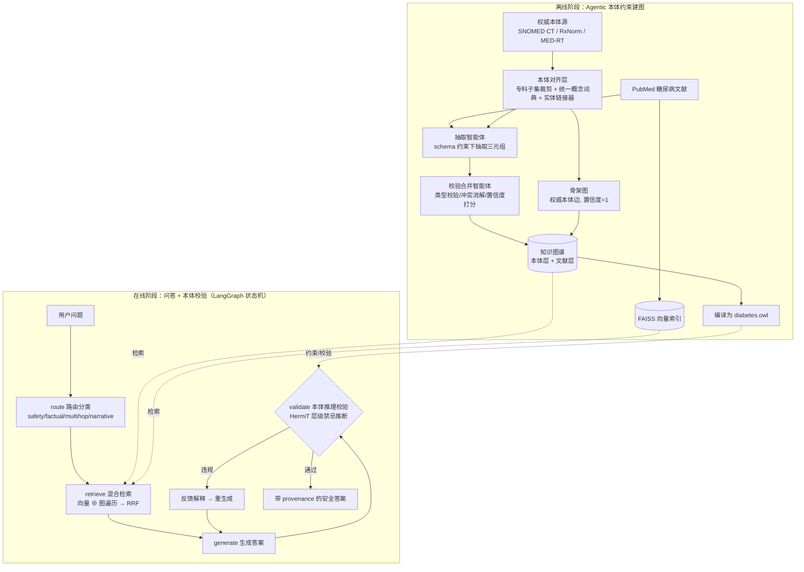

# 开题报告

**论文题目：** 融合本体推理的 Agentic GraphRAG 在糖尿病临床问答中的研究与实现

**英文题目：** Ontology-Reasoning-Enhanced Agentic GraphRAG for Clinical Question Answering in Diabetes

---

## 1 选题的研究意义及国内外研究现状综述

### 1.1 选题的研究意义

#### 1.1.1 研究背景

**(1) 糖尿病已成为全球与我国最严峻的公共卫生挑战之一。** 糖尿病是一种以慢性高血糖为特征的代谢性疾病，可累及心、脑、肾、眼、神经、血管等多个靶器官，是心血管疾病、终末期肾病、失明及非创伤性截肢的重要病因。据国际糖尿病联盟（International Diabetes Federation, IDF）《全球糖尿病地图》（第 10 版，2021）统计 [19]，全球 20—79 岁成年人糖尿病患者数已达约 5.37 亿，患病率约 10.5%，并预计到 2045 年将增至约 7.83 亿；2021 年全球与糖尿病相关的卫生支出超过 9660 亿美元。我国形势尤为严峻：基于全国性流行病学调查 [20]，我国成人糖尿病患病率已升至约 11.2%，患者总数约 1.4 亿，居世界首位，且其中近半数患者未被诊断、知晓率与控制率均不理想。糖尿病及其并发症给患者、家庭和医疗体系带来了沉重的疾病与经济负担。

**(2) 优质医疗资源紧缺且分布不均，难以满足海量慢病管理需求。** 糖尿病作为典型慢性病，需要长期、个体化、连续的随访管理与用药调整，而我国内分泌专科医师数量相对有限、且高度集中于大城市三级医院，基层医疗机构在糖尿病规范化诊疗与并发症筛查方面能力相对薄弱。庞大的患者群体与有限的专科诊疗资源之间存在结构性矛盾，单纯依靠扩充医师队伍难以在短期内弥合这一缺口。因此，借助人工智能提供准确、可靠、可解释的临床问答与决策支持，以辅助医生提升诊疗效率、赋能基层、支持患者教育，具有迫切的现实需求。

**(3) 大语言模型为智能化临床支持带来机遇，但其可信落地仍存在根本障碍。** 近年来，以 GPT、DeepSeek、Qwen 等为代表的大语言模型（Large Language Model, LLM）在自然语言理解与生成上取得突破性进展，并在美国执业医师资格考试（USMLE）、临床决策支持、患者教育与医患沟通等任务中展现出接近甚至超越人类专家的潜力，被寄望于缓解上述医疗资源压力。然而，将 LLM 真正部署到医疗这一高风险（high-stakes）领域，仍面临三重根本性障碍：

1. **幻觉（Hallucination）**。LLM 会生成看似流畅、表达自信，却与医学事实相悖的内容。在通用场景中幻觉或许只是表述瑕疵，但在临床场景中，一次幻觉可能直接导致错误诊断或危险用药，造成不可逆的患者伤害。
2. **知识时效性不足（Knowledge Staleness）**。模型的参数化知识固化于训练截止时刻，难以及时反映最新的临床指南、药品说明书更新与药物安全警示，而医学知识恰恰处于持续更新之中。
3. **推理过程不可解释、不可审计（Lack of Explainability and Auditability）**。模型往往"只给结论、不给依据"，无法将结论追溯到权威知识来源与明确的推理链条，这与医疗场景对可解释、可问责（accountability）的强制性要求存在根本冲突。

**(4) 现有检索增强技术只解决"证据相关性"，无法保证"逻辑正确性"。** 检索增强生成（Retrieval-Augmented Generation, RAG）通过在生成前检索外部知识库，把"参数化知识"与"非参数化的外部证据"相结合，部分缓解了幻觉与时效性问题；图检索增强生成（Graph Retrieval-Augmented Generation, GraphRAG）则进一步以知识图谱（Knowledge Graph, KG）的结构化关系支撑多跳（multi-hop）临床逻辑推理，自 2024 年以来已成为医学人工智能领域的研究热点。然而，无论是 RAG 还是 GraphRAG，其技术本质都是"**提供相关证据**"——它们**只能保证检索到的内容与问题相关，却无法判断模型最终生成的答案是否违反了医学逻辑约束**。

以一个具体而典型的临床场景为例：一位合并慢性肾衰竭的 2 型糖尿病患者需要起始降糖治疗，一个仅依赖参数化知识或普通 RAG/GraphRAG 的系统，完全可能"流畅而自信地"推荐某种在肾功能严重受损时存在明确禁忌的药物（如二甲双胍或卡格列净等 SGLT2 抑制剂）。即便检索层成功召回了相关证据，系统也不具备"判断该推荐是否违反禁忌"的逻辑推理能力。这类错误直接关系患者安全，且表面上完全合理、极难被察觉，其危害远高于普通的事实性幻觉。这正是当前医学 GraphRAG 亟待补齐的关键短板，也是本课题选题的直接动因。

综上，在糖尿病这一患病人数庞大、医疗资源紧张、用药安全约束突出的领域，研究一种既能利用大语言模型生成能力、又能提供逻辑级安全保障与可追溯性的可信临床问答方法，兼具迫切的现实需求与重要的研究价值。

#### 1.1.2 研究意义

**(1) 理论意义**

第一，本课题面向大语言模型在高风险医疗场景中的可信性难题，提出并系统论证本体双重接地机制，即让权威医学本体在系统中承担建图约束与输出校验双重角色。这一机制突破了既有检索增强方法仅停留于证据相关性的局限，在生成结果之上叠加一道逻辑正确性的判定防线，为可信医学人工智能与神经符号融合提供了新的方法论视角，丰富了大语言模型与符号知识系统协同推理的理论体系。

第二，本课题提出层级化禁忌推理方法，将用药安全判定形式化为描述逻辑中的分类与包含关系问题，借助本体的概念层级与推理机的自动分类能力，使系统不仅能够识别字面上显式声明的禁忌，还能沿疾病层级推断出更具体病种的特异化禁忌。该方法从原理上克服了传统字符串或三元组匹配在面对病种特异化时容易产生危险假阴性的缺陷，揭示了符号推理相对于浅层匹配在安全攸关判定中的不可替代价值，对知识引导的可解释推理研究具有理论参考意义。

第三，本课题探索了一种神经生成与符号校验相分离、又通过自纠错回环相耦合的体系结构。生成环节发挥大语言模型的语言理解与表达优势，校验环节由确定性推理机给出可证明、可追溯的安全裁决，二者经由智能体编排形成闭环。这种将不确定的神经过程与确定的符号过程解耦协作的设计思想，为在更广泛领域构建兼具生成能力与安全保障的人工智能系统提供了可借鉴的理论框架。

**(2) 实践意义**

第一，本课题面向糖尿病这一患病人数庞大、医疗资源紧张、用药安全约束突出的领域，构建了一个准确、安全、可审计的临床问答原型系统，覆盖了从权威本体与知识图谱构建、混合检索、答案生成到本体推理校验与自纠错的完整流程，为大语言模型在专科医疗场景的落地提供了一条可复现、可工程化的技术路径，对辅助医生决策、赋能基层诊疗、支持患者教育具有现实应用价值。

第二，本课题将用药禁忌违规率与结论可追溯率确立为面向安全的核心评测指标，并自建糖尿病安全禁忌评测集，弥补了既有问答评测偏重准确率、忽视临床安全维度的不足。该评测设计为临床决策支持系统的安全性量化与横向比较提供了实践参照，有助于推动医疗人工智能从能用走向可信、可问责。

第三，本课题提出的病情侧采用确定性实体链接、用药侧由逻辑推理机裁决的工程设计，使安全防线建立在确定性知识与可证明推理之上，而非依赖模型自身判断，显著提升了系统在安全攸关场景中的稳健性与可信度。这一思路对其他需要严格安全约束的垂直领域智能系统，例如金融合规、法律咨询等，同样具有迁移借鉴价值。

---

### 1.2 国内外研究现状综述

围绕本选题，国内外研究现状可从三个相互关联的方向加以梳理：医学领域的 GraphRAG、本体与神经符号融合、糖尿病领域的知识图谱与问答应用。

#### 1.2.1 医学领域的 GraphRAG

大语言模型具备一专多能的强大生成能力，已被越来越多地应用于病案自动生成、电子病历实体识别等医疗任务，但仅依靠大语言模型自身存在明显局限。戴琼海等 [25] 指出，大模型的应用能力仍受诸多限制，其幻觉等效应的产生机理与解决方案尚待深入探索；韩伟鹏等 [26] 的实验也表明，大语言模型在理解力、可靠性、逻辑性等方面得分较高，而在准确性与安全性方面相对不足。在医疗场景下，准确性与安全性尤为关键，因此整合权威外部知识来源以降低大语言模型的幻觉，便成为可信医疗人工智能的核心诉求。

为缓解上述问题，Lewis 等 [1] 提出检索增强生成（Retrieval-Augmented Generation, RAG）技术，其核心思想是通过外部知识库检索来弥补大语言模型知识过时与事实错误的缺陷，使模型能够在推理过程中动态访问并整合与上下文相关的最新医学知识。然而，纯文本检索难以刻画复杂逻辑关系并支撑多跳推理，为此 Xu 等 [27] 将结构化的知识图谱数据集成到 RAG 的检索模块中，以提升检索质量并生成更准确、连贯的输出，推动了大语言模型从语义匹配走向逻辑关联。围绕检索质量的提升，孙亚茹等 [28] 进一步提出结合自适应检索增强与生成增强的优化策略，通过对外部数据库内容的过滤与补全保证输入内容的相关性。

知识图谱能够将大量非结构化文本转化为结构化知识，更好地帮助大语言模型理解外部知识的结构。2024 年，微软团队 [2] 在 RAG 框架基础上提出融合知识图谱的创新架构 GraphRAG，将非结构化文本转化为实体关系图谱，依托图结构的拓扑特性实现多跳检索，有效弥补了 RAG 仅依赖文本块相似度匹配、难以捕捉深层逻辑关联的缺陷，显著提升了生成内容的信息完整性与语义一致性。此后涌现出众多基于知识图谱增强大语言模型生成能力的研究：陈静等 [29] 的研究表明，与知识库非结构化知识提示相比，知识图谱结构化知识提示在精确度、召回率和 F1 值上表现更佳，揭示了结构化知识在增强模型理解能力中的关键作用；朱星图等 [30] 利用多个公共知识图谱提出一种动态语义网构造方式 AWDSN，通过多知识源增强语义检索；此外亦有工作 [31] 基于 GraphRAG 将知识图谱属性与基于嵌入的检索系统相结合，通过双层检索与增量更新机制，在保持图 RAG 优势的同时大幅降低了计算与部署成本。

在医学领域，GraphRAG 因能够支撑结构化的临床逻辑推理、实现更具情境感知与可解释性的诊断而备受关注。MedGraphRAG（Wu 等，arXiv:2408.04187）[3] 提出三元组图构建与 U-Retrieval 机制，将抽取的数据链接到权威医学论文与词典，并以构建安全医学大模型为目标，是医学 GraphRAG 的奠基性工作之一；KG4Diagnosis（Zuo 等，arXiv:2412.16833）[4] 采用层级多智能体架构结合知识图谱增强诊断，讨论了将 SNOMED CT、UMLS 与大语言模型抽取相结合的混合方案。将大语言模型作为自主智能体来构建与维护医学知识图谱，是这一方向的新近进展，AMG-RAG（Rezaei 等，EMNLP 2025 Findings / arXiv:2502.13010）[10] 实现了自动建图、边置信度打分与来源追踪，并在 MedQA 等基准上取得了有竞争力的结果，其置信度打分与来源追踪思想为本课题的建图阶段提供了直接借鉴。面向具体应用，周利琴等 [32] 提出融合知识图谱嵌入与大语言模型检索增强的推荐框架，为心理健康平台用户提供更有效的健康信息推荐；孟序阳等 [33] 构建中医古籍细粒度知识图谱，并以提示学习方式将其融入大语言模型，构建了面向《伤寒论》的问答系统，表明知识图谱与提示工程的融合能显著提升大语言模型的问答能力；Zhao 等 [34] 提出 MedRAG 框架，将分层诊断知识图谱与电子病历数据相结合，降低了误诊率并支持主动的后续提问；Song 等 [35] 引入面部表型特征构建知识图谱，利用 RAG 提升了大语言模型在罕见遗传疾病诊断上的准确性与响应一致性。这类工作充分证明了知识图谱对医学多跳推理的价值，但其重心始终在检索增强与图谱构建，普遍未以权威本体施加硬约束，也未在输出端引入逻辑级的一致性校验。

此外，多模态知识图谱在医学领域亦受到关注。医学多模态数据既包含临床记录、电子病历等文本，也包含 X 光、CT、MRI 等影像，能够更全面地反映患者健康状况。陈囿任等 [36] 强调了多模态知识融合在多模态知识图谱构建中的重要性，并分析了多模态预训练模型在其中的作用；时振普等 [37] 重点分析了多模态知识图谱融合涉及的多模态实体对齐与实体链接等关键技术，对其提升医疗智能化水平做出了展望。

在国内，医学知识图谱与医学问答的研究起步较早、积累深厚。北京大学等机构构建并开放了中文医学知识图谱 CMeKG [5]，为中文医学自然语言处理提供了重要的知识底座；近两年随着医学大模型兴起，国内涌现出一批面向中文医疗的大模型，如华佗 GPT（HuatuoGPT）[6]、本草/华驼（BenTsao）[7]、仲景（Zhongjing）[8]、DISC-MedLLM [9]、扁鹊（BianQue）等，部分工作已开始尝试以医学知识图谱或指南知识增强大模型的可靠性。但综观国内外，将权威本体的逻辑推理作为输出端安全校验器、并融入图谱增强问答闭环的研究仍较为缺乏。

#### 1.2.2 本体、描述逻辑与神经符号融合

本体（Ontology）以形式化方式描述领域概念及其关系，配合描述逻辑推理机可进行严格的一致性校验与分类推断。OWL（Web Ontology Language）是 W3C 推荐的本体语言，HermiT [11]、Pellet、ELK 等是其主流推理机；owlready2 [12] 等工具则为在 Python 中加载、操作本体并调用推理机提供了便利。这一符号化技术栈在生物医学本体（如 SNOMED CT [13]、RxNorm [14]）领域已有成熟应用。

神经符号融合（Neuro-Symbolic AI）旨在结合神经网络的感知/生成能力与符号系统的严谨推理能力，被视为提升大模型推理可靠性的重要途径。IJCAI 2025 的综述（Yang 等）[15] 将 LLM 与符号方法的结合归纳为 Symbolic→LLM、LLM→Symbolic、LLM+Symbolic 三类范式。其中，*Enhancing LLMs through Neuro-Symbolic Integration and Ontological Reasoning*（arXiv:2504.07640）[16] 利用 OWL + HermiT 进行一致性校验与迭代纠错，直接支撑了本课题"本体作为校验器"的核心设计；*Ontology-Constrained Neural Reasoning in Enterprise Agentic Systems*（arXiv:2604.00555）[17] 进一步指出"本体接地在 LLM 训练数据覆盖最弱处价值最大"，这与本课题聚焦"长尾用药禁忌"判断的出发点高度契合。

在国内，神经符号融合与知识引导的可信推理同样是受关注的前沿方向。多家高校与研究机构在知识图谱推理、逻辑约束下的神经推理、可解释 AI 等方面开展研究，并维护了相关开源资源库。但将描述逻辑推理机作为大模型输出端的"在线校验器"、并面向医疗安全场景做层级化推断的工作，目前仍处于探索初期。

#### 1.2.3 医学领域的知识图谱研究

随着人工智能与大数据技术的迅猛发展，信息以爆炸方式增长，且形式多样、关系复杂，如何有效组织与表示海量知识已成为亟待解决的问题。知识图谱因其强大的知识表示与推理能力而备受关注，不少学者围绕知识图谱的表示与查询展开研究。Zou 等 [38] 提出一种基于知识图的图模型，实现图层次拓扑序列的精确匹配查询，可快速过滤不合格的候选集，在匹配效率与时间性能上更具优势；Kun 等 [39] 提出可扩展确定性知识图谱嵌入模型的框架 WeExt，使其能够学习加权知识图谱的嵌入；Zhang 等 [40] 提出层次感知配对关系向量知识图谱嵌入模型，利用二维坐标精准建模关系模式、多关系类型与层次特征，以适应多关系场景；何鹏等 [41] 基于张量分解提出类型增强的时态知识图谱表示学习模型，显式融合时间信息并利用实体关系间的类型兼容性，进一步挖掘隐含的类型特征。

凭借上述特性与优势，知识图谱在众多领域得到广泛应用。例如在工艺规划领域，Zhou 等 [42] 设计了一种基于分布式图嵌入的序列知识图谱卷积网络模型，将装配过程知识图谱中的节点与关系转换为低维向量并学习其依赖关系，从而生成合理的装配过程规划，表明知识图谱技术在特定领域具有广阔的应用前景。

在生物医学领域，文献、电子病历与数据库记录了大量复杂疾病信息，如何从中高效提取并整合知识以助力临床诊疗已成为重要挑战，已有学者应用知识图谱在医学问答、检索、数据分析与药物再利用等方面取得显著成果。在医学问答方面，Ming 等 [43] 提出基于知识图谱的问答系统 DSQA，借助电子病历与知识图谱回答特定领域的医学问题，兼具较高的可解释性与优异性能；Rajabi 等 [44] 使用 Neo4j 为疾病数据库构建疾病知识图，用以回答耗时且劳动密集的复杂问题；Hasan 等 [45] 开发了面向特定场景查询、外部数据集链接、迭代分析与数据可视化的知识图谱原型。在药物再利用方面，Zhu 等 [46] 基于高质量文献与多个生物医学数据集构建了包含 115 种罕见病的知识图谱以辅助加速药物开发；Aisopos 等 [47] 比较了不同链接预测方法在生物医学文献知识图谱上识别未知药物—基因相互作用的能力。

上述研究主要聚焦生物医学的普遍情况，对复杂疾病领域的特殊需求与挑战挖掘不足，针对复杂疾病构建详尽知识图谱仍存在较大探索空间。在这一方向上，亦有学者开展专门研究：在肿瘤领域，Wang 等 [48] 提出 ATOM 方法，通过抗肿瘤实体识别、句子简化、三元组与谓词映射等流程从生物医学文献构建抗肿瘤生物材料知识图谱；Xiu 等 [49] 以细粒度、语义化方式表示并整合中文电子病历数据，构建了语义驱动的消化系统肿瘤知识图谱。在高血压领域，Zhou 等 [50] 依据中国高血压指南将传统知识表示与知识图谱表示相结合，构建专门的高血压药物知识图谱，并据此开发了相应的临床决策支持系统。在哮喘领域，Asaad 等 [51] 从生物医学文献中挖掘信息，构建了首个哮喘与环境相互作用的知识图谱。

在糖尿病这一与本课题直接相关的疾病领域，已有学者取得显著成果。Yin 等 [52] 利用上海瑞金医院电子病历数据，通过患者医学记录中的相关参数与特征信息设计构建糖尿病知识图谱，并提出基于 Transformer 的深度神经网络予以完善；针对 2 型糖尿病，Wang 等 [53] 在循证医学基础上整合多个数据库，构建 2 型糖尿病及其并发症图谱，并以逻辑模型构建风险预测模型，纳入图谱以可视化每位患者的并发症风险评分；Zhang 等 [54] 通过分析大量多组临床数据集，构建了 2 型糖尿病的数字孪生框架，将机器学习与多组数据知识图谱、机制模型相结合以预测疾病进展。与本课题最为贴近的是 Evangelista 等 [18] 面向妊娠期糖尿病的 GraphRAG 概念验证工作，其使用约 1200 篇 PubMed 文献结合 Neo4j 构建图谱并配合本地大模型做临床决策支持，提出的多维度、面向临床适用性的评测思路对本课题评测框架设计具有重要参考价值。

总体来看，国内外在医学知识图谱的表示学习、构建方法与领域应用上已积累了丰富成果，并在高血压、肿瘤、糖尿病等复杂疾病上展开了专门探索，国内依托大规模诊疗数据与中文电子病历亦形成了独特优势。但现有工作多聚焦于知识图谱的构建、表示与检索增强，少数结合了临床决策支持，普遍未将权威本体用于输出端的逻辑级安全校验，面向用药禁忌的可证明、可追溯安全防线仍属空白，这正是本课题的切入点。

#### 1.2.4 研究述评

综合上述三个方向的国内外研究现状，可以得到如下评述。

第一，医学领域的 GraphRAG 与智能体化的知识图谱构建已较好地解决了证据相关性问题，能够通过结构化检索与来源追踪提升答案质量与可追溯性，但其本质仍是为生成提供相关上下文，无法在逻辑层面判断答案是否违反医学约束，因而难以稳定消除诸如用药禁忌这类安全攸关的危险答案。

第二，本体、描述逻辑与神经符号融合的研究为逻辑级校验提供了成熟的理论基础与工具支撑，已有工作证明可借助本体推理机对大模型输出进行一致性校验与迭代纠错；但这类研究多停留在通用或企业场景，尚未与医学知识图谱增强问答充分结合，更缺乏面向临床用药安全、能够处理病种层级特异化的专门方法。

第三，糖尿病领域已有的知识图谱与 GraphRAG 应用验证了文献语料结合知识图谱的可行性，并积累了面向临床适用性的评测经验，但普遍止步于检索增强，未在输出端建立本体级的安全防线，对禁忌违规这一核心安全指标缺乏针对性的建模与评测。

综上，现有研究大多停留在图检索增强或智能体建图，而将权威本体同时用于建图约束与输出端逻辑校验、并融入智能体编排闭环的工作仍较为缺乏，面向临床用药安全的逻辑级防线尚属空白。本课题正是从这一研究空白切入，提出并实现本体双重接地机制与层级化禁忌推理方法，以糖尿病临床用药问答为载体，验证逻辑正确性防线在医疗安全维度上的不可替代价值。

---

## 2 研究目标、研究内容和拟解决的关键问题

### 2.1 研究目标

本课题的总体目标是：面向糖尿病临床用药问答场景，设计并实现一个融合本体推理的 Agentic GraphRAG 系统，在充分发挥大语言模型生成能力的同时，借助权威医学本体的逻辑推理为答案提供一道逻辑级的安全防线，使系统在保持答案准确性与临床适宜性的前提下，显著降低用药禁忌违规率，并使每一个关键结论都可追溯到权威知识与明确的推理依据。

围绕这一总体目标，本课题进一步细化为以下四个具体目标。

第一，构建语义可约束、来源可追溯的糖尿病专科知识底座。融合 SNOMED CT、RxNorm、MED-RT 等权威术语与本体资源，抽取糖尿病专科本体子集与统一概念词典，并以本体 schema 约束大语言模型从 PubMed 文献增量扩充知识图谱，从源头保证图谱质量与可审计性。

第二，建立面向用药安全的逻辑级校验能力。将用药禁忌知识编码为 OWL 描述逻辑公理，借助推理机实现层级化禁忌推断，使系统不仅能识别显式声明的禁忌，还能沿疾病概念层级推断出更具体病种的特异化禁忌，从原理上避免危险的假阴性。

第三，实现具备自纠错能力的端到端问答闭环。以智能体编排方式将问题路由、混合检索、答案生成、本体校验与纠错回环串联为完整工作流，使系统在检出违规答案时能够自动反馈并重新生成，最终输出带来源标注的安全答案。

第四，建立面向安全的多维度评测体系。提出以禁忌违规率与可追溯率为核心的评测指标，自建糖尿病安全禁忌评测集，并通过多方法对比与消融实验，量化验证本体推理校验层在临床安全维度上的有效性与不可替代性。

### 2.2 研究内容

依据上述目标，本课题的研究内容划分为离线建图与在线问答两个阶段，共六个相互衔接的部分，如下所述。

#### 2.2.1 糖尿病专科本体对齐与统一概念词典构建

本部分负责构建系统的语义骨架。研究内容包括：从糖尿病顶层概念出发，对 SNOMED CT 的 RF2 核心数据进行专科子集裁剪，并特别处理糖尿病并发症不通过 is-a 关系挂接的问题，沿由……引起、与……相关、在……之后等定义性关系扩展子集，以覆盖糖尿病肾病、糖尿病视网膜病变等关键并发症；基于 ATC 分类从 RxNorm 抽取降糖药成分及商品名，并通过 RxClass 接口从 MED-RT 获取降糖药的用药禁忌关系；制定关系 schema，明确合法的节点类型与边类型及其映射规则，将上述多来源知识融合为统一的概念词典与本体边集合，并抽取同义词以支持实体链接。最终产出供建图、检索与校验三处复用的统一概念底座，以及一个轻量、可在本地高效运行的实体链接器。

#### 2.2.2 本体 schema 约束的 Agentic 知识图谱构建

本部分以本体骨架为约束，利用大语言模型作为抽取智能体从文献中扩充知识图谱。研究内容包括：以权威本体边构建高可信的骨架图；设计抽取智能体，先以实体链接识别已知概念，再在 schema 提示下从 PubMed 摘要抽取三元组并回映射到本体概念；设计校验合并智能体，对候选三元组施加实体链接过滤、类型校验、去自环、冲突消解与基于多文献证据的置信度打分。研究还需明确本体层权威边与文献层抽取边的分层信任策略，确保安全攸关的禁忌判断仅建立在确定性的权威知识之上，而文献层知识仅用于丰富检索证据。

#### 2.2.3 融合向量检索与图遍历的混合检索机制

本部分针对临床问题形态异质的特点设计混合检索。研究内容包括：将文献摘要嵌入并建立向量索引，以处理叙述型与机制类问题；将知识图谱加载为内存结构，以实体链接定位种子概念并进行有限跳数的多跳遍历，以处理结构化的多跳临床逻辑；采用倒数排名融合方法合并两路异质结果，避免对不同来源分数做尺度归一；并根据问题类型对两路检索动态调整权重。融合后的证据需带有来源标注，为下游生成与可追溯性提供基础。

#### 2.2.4 本体推理校验与自纠错回环（核心研究内容）

本部分是本课题的核心创新。研究内容包括：将知识图谱编译为 OWL 本体，把概念映射为类、把权威层级关系映射为子类关系，并通过术语桥接打通 SNOMED 疾病层级与 MED-RT 禁忌术语；为每种药物构造禁忌条件类，将该药的全部禁忌病种设为其子类，从而把禁忌判定转化为描述逻辑中的分类与包含问题；调用推理机完成自动分类，依据病情类的祖先闭包中是否包含药物的禁忌类来判定违规，实现层级化禁忌推断，并为每个判定给出可追溯的公理、触发病种与来源；在此基础上构建自纠错回环，由问题侧确定性抽取病情、答案侧抽取推荐用药，交由推理机裁决，一旦检出违规即将解释反馈给大语言模型并触发重生成，直至通过或达到最大重试次数。

#### 2.2.5 基于状态机的 Agentic 编排与端到端实现

本部分将上述模块组织为可自主决策、含条件回环的端到端系统。研究内容包括：以状态机方式定义问题路由、检索、生成、校验与条件纠错等节点及其流转；设计路由策略，将问题分类并据此设定检索权重；实现生成—校验—纠错的条件回环，使纠错次数由运行时的校验结果动态决定；并封装统一的大语言模型与嵌入访问层，支撑全流程稳定调用。

#### 2.2.6 面向安全的评测框架与数据集构建

本部分负责系统性地验证研究效果。研究内容包括：构建统一的评测框架，支持多方法、多数据集的批量评测与逐题明细记录；设计以禁忌违规率、可追溯率、平均纠错轮次、概念覆盖度、临床适宜性与准确率为核心的多维度指标体系；自建糖尿病安全禁忌评测集（含开放推药、安全选择题与判断题），并辅以公开医学问答数据集的糖尿病相关子集；通过纯大语言模型、向量检索、图检索、混合检索与本方法五种方法的对比与消融实验，量化分析本体校验层带来的净增益。

### 2.3 拟解决的关键问题

本课题在实现上述研究内容的过程中，需要重点解决以下四个关键问题。

#### 2.3.1 权威本体对自动抽取知识的语义约束问题

大语言模型从文献自动抽取的三元组质量参差不齐，普遍存在实体歧义与关系冲突，若直接入图将污染知识底座并损害可审计性。关键在于如何把权威本体的 schema 转化为对抽取过程的硬性约束，使抽取结果在节点类型、边类型与端点合法性上必须对齐本体，并通过冲突消解与置信度打分实现权威知识优先、文献证据补充的分层信任。解决该问题是保证后续检索与校验可靠性的前提。

#### 2.3.2 面向病种层级特异化的逻辑级禁忌校验问题

这是本课题最核心、也最具挑战性的关键问题。临床中患者的实际诊断往往是某个禁忌病种的更具体子类，例如某禁忌针对慢性肾衰竭，而患者诊断为糖尿病肾病某一分期，单纯的字符串或三元组匹配会因字面不一致而漏判，造成危险的假阴性。关键在于如何借助本体的概念层级与描述逻辑推理机的自动分类能力，将禁忌判定形式化为包含关系判定，使系统能够沿层级推断出子类病种同样禁忌，并保证每个判定结论可证明、可追溯。

#### 2.3.3 神经生成与符号校验的解耦协作与自纠错收敛问题

大语言模型的生成是不确定的，而安全校验要求确定性，二者如何协同是系统稳健性的关键。需要解决的问题包括：如何将不可靠的语言生成与确定的逻辑裁决在架构上解耦，使安全防线不依赖模型自身判断；如何从问题侧可靠地获取患者病情、从答案侧准确地区分推荐用药与建议避免的用药；以及如何设计反馈与回环机制，使系统在检出违规后能够有效纠错并稳定收敛，避免反复震荡或无法终止。

#### 2.3.4 临床问答安全性的可量化评测问题

既有医学问答评测多以准确率为中心，难以反映医疗场景最关切的用药安全与可解释性，且开放式生成任务的安全性缺乏客观、自动的判定手段。关键在于如何设计一套面向安全的多维度评测指标与可复现的评测流程，特别是如何利用本体校验器作为客观裁判自动判定开放推药答案是否违规，从而把抽象的安全性转化为可度量、可比较、可复现的量化结果，为方法有效性提供有说服力的证据。

---

## 3 研究方法、技术路线、实验方案与可行性分析

### 3.1 研究方法

本课题属于面向真实临床需求的系统构建型研究，采用神经符号融合的总体方法论，将大语言模型的神经式生成与权威本体的符号式推理相结合，并辅以工程实现与实验验证。具体而言，主要采用文献调研法、知识抽取与本体建模法、对比实验法三类研究方法。

**（1）文献调研法**

文献调研法是系统挖掘已有研究成果、构建理论基础的核心方法。本研究聚焦大语言模型、检索增强生成、知识图谱、本体推理与神经符号融合等主题，通过中国知网、Web of Science、arXiv 等数据库，以大语言模型医疗应用、医学 GraphRAG、智能体知识图谱、描述逻辑推理、用药禁忌等为关键词检索文献。在此基础上，梳理大语言模型的工作原理与局限、RAG 与 GraphRAG 的技术路径，以及本体与描述逻辑推理在可信人工智能中的作用，厘清现有医学 GraphRAG 普遍缺乏输出端逻辑级安全校验这一关键研究空白，为本体双重接地架构设计与层级化禁忌推理方法的提出提供理论支撑，明确研究目标与创新方向。

**（2）知识抽取与本体建模法**

知识抽取与本体建模法用于从权威资源与文献中精准获取实体与关系，并将其形式化为可推理的本体，为知识图谱构建与安全校验提供基础支撑。本研究综合运用知识抽取与本体建模技术，对糖尿病专科知识与文献语料进行深度解析，旨在为图谱构建及本体推理校验提供高质量、可审计的知识支撑。

首先，针对权威本体资源 SNOMED CT、RxNorm、MED-RT 与 PubMed 糖尿病文献的原始语料，进行清洗与重组：从糖尿病顶层概念出发裁剪 SNOMED CT 专科子集，并沿并发症相关的定义性关系扩展，避免遗漏不通过 is-a 挂接的并发症；以摘要为单位实施语义分块，构建具备主题一致性的结构化知识块；在文献语料处理中精准筛选糖尿病领域的高质量内容。

其次，依托大语言模型的上下文学习与语义解析能力，从结构化知识单元中自动抽取疾病、症状、药物等核心实体及其逻辑关联：通过设计特定的提示模板并施加本体 schema 约束，系统性识别文献中的病因关联、诊疗关系与用药禁忌等知识，完成从纯文本到知识图谱的知识转化，并对候选三元组进行类型校验、冲突消解与置信度打分。

最后，针对临床术语不规范、表达口语化导致的实体歧义与映射不精准问题，引入 SNOMED CT、RxNorm、MED-RT 等权威术语体系进行术语归一化与桥接处理，将非标准术语与专业医学知识库逻辑锚定；并进一步把对齐后的知识图谱编译为 OWL 本体，将概念映射为类、权威层级映射为子类、用药禁忌形式化为描述逻辑公理，从而解决垂直领域实体关系抽取难、术语映射不精准以及安全知识难以参与逻辑推理的关键问题。

**（3）对比实验法**

对比实验法用于验证融合本体推理的 Agentic GraphRAG 在临床问答中的应用效果。本研究设计了多维度的交叉验证实验，设定本方法组（混合检索叠加 OWL 本体校验与自纠错回环，即本研究构建的完整系统）为实验组，并设置纯大语言模型基线组（直接调用通用大语言模型回答）、向量检索组、图检索组与混合检索组（无本体校验）等多组对照组，使其层层递进、构成天然的消融实验，并在相同设置下调用同一基础大语言模型以保证对比公平。实验以禁忌违规率、可追溯率、临床适宜性与答题准确率等为核心指标，在自建糖尿病安全禁忌评测集与公开数据集子集上开展，并通过多次独立运行与逐题明细统计分析对比结果，验证本体双重接地架构在医疗安全维度上的有效性与不可替代性，明确系统在糖尿病临床用药问答场景的性能提升路径，为技术落地提供实证依据。

### 3.2 技术路线

本课题采用离线建图与在线问答相衔接的总体技术路线，核心是让权威医学本体在建图端与输出端两次接地。总体流程如图 3-1 所示。

技术路线的关键环节与方法选型如下。

**(1) 本体对齐与知识底座构建。** 从糖尿病顶层概念出发裁剪 SNOMED CT 专科子集，并沿并发症相关的定义性关系扩展，避免遗漏不通过 is-a 挂接的并发症；从 RxNorm 抽取降糖药、从 MED-RT 抽取用药禁忌，融合为统一概念词典与本体边；实体链接采用基于专科概念词典的轻量最长匹配方案，兼顾准确性与本地可运行性。

**(2) Agentic 知识图谱构建。** 以 networkx 加载权威本体边构成骨架图，以大语言模型为抽取智能体在 schema 提示下从文献抽取三元组，再经校验合并智能体施加类型校验、冲突消解与置信度打分；采用本体层权威边与文献层抽取边的分层信任策略，安全判定只依赖权威层。

**(3) 混合检索与融合。** 文献摘要经嵌入模型编码后存入向量索引处理语义相似问题；知识图谱以内存结构支持多跳遍历处理结构化逻辑问题；两路结果以倒数排名融合合并，并按问题类型动态调权，融合证据带来源标注。

**(4) 本体推理校验与自纠错。** 将知识图谱编译为 OWL，概念映射为类、权威层级映射为子类，并桥接 SNOMED 与 MED-RT 术语；为每种药物构造禁忌条件类，将禁忌判定转化为包含关系判定，由推理机自动分类后依据祖先闭包判定违规；问题侧确定性抽取病情、答案侧抽取推荐用药交由推理机裁决，违规则反馈纠错并重生成。

**(5) Agentic 编排与统一访问层。** 以状态机方式串联路由、检索、生成、校验与条件纠错节点，使纠错次数由运行时校验结果动态决定；统一封装大语言模型与嵌入的访问接口，内置重试与超时以保证全流程稳定。

**技术栈选型：** 运行环境采用 Python 3.11；本体处理与推理采用 owlready2 调用 HermiT 推理机；向量检索采用 FAISS；图存储采用 networkx 内存图并辅以 CSV/GraphML 持久化，可选 Neo4j 用于可视化；智能体编排采用 LangGraph；大语言模型与嵌入分别采用 DeepSeek 系列模型与 bge-m3，通过 OpenAI 兼容接口调用，以兼顾成本、可达性与免本地部署。

### 3.3 实验方案

#### 3.3.1 数据集

考虑到医学领域缺乏现成的糖尿病专用问答基准，本课题采取通用集筛取子集与自建专科集相结合的双轨策略。

- **知识源（建图用）：** SNOMED CT、RxNorm、MED-RT 等权威术语与本体资源，以及 PubMed 糖尿病相关文献摘要作为文献语料与向量库来源。
- **自建糖尿病安全禁忌评测集：** 包括开放推药任务（给出合并某病情的患者要求推荐降糖药）、安全相关选择题与判断题，专门用于验证本体校验层在用药安全上的价值。
- **公开数据集子集：** 从 MedQA、PubMedQA 等筛取糖尿病相关子集，用于评估引入检索与校验对标准化考题准确率的影响。

#### 3.3.2 对比方法（亦构成消融）

设置五种层层递进的方法，使其本身构成一组消融实验：纯大语言模型（无检索，下界基线）、向量检索（加文献检索）、图检索（加图谱检索）、混合检索（向量与图 RRF 融合、无本体校验）、本方法（混合检索叠加 OWL 校验与自纠错）。其中本方法相对混合检索的差异即为本体校验层的净增益。所有方法统一采用相同的基础大语言模型，以保证对比公平。

#### 3.3.3 评测指标

围绕安全性、可解释性、稳健性、充分性、质量与知识能力六个维度，设计多维度指标体系：以禁忌违规率作为面向安全的核心指标，由本体校验器作为客观裁判自动判定开放推药答案是否违规；以可追溯率衡量结论可映射到图路径或本体公理的比例；以平均纠错轮次反映自纠错机制的触发与收敛；以概念覆盖度（答案中可链接到本体的医学概念数）代理信息充分性；以临床适宜性（采用大模型作为评审，按安全、适宜、具体打分）综合衡量答案质量；以准确率衡量标准化考题上的知识能力。

#### 3.3.4 实验设计与流程

实验分三组展开。第一组为核心的开放推药任务多维度对比，在自建开放推药集上比较五种方法的禁忌违规率、可追溯率、纠错轮次、概念覆盖度与临床适宜性，验证本方法能否在保持质量的同时显著降低甚至消除禁忌违规；考虑到生成存在采样波动，对关键结论进行多次独立运行以佐证稳定性。第二组为标准化准确率评测，在安全选择题、判断题与公开数据集子集上比较各检索方法相对纯大语言模型的增益，界定系统的适用边界。第三组为定性案例分析，选取典型的合并禁忌场景，对比各方法的真实响应，直观展示本体校验层在拦截危险推荐上的作用。全部逐题结果予以保存，支持复现与误差分析。

#### 3.3.5 预期结果

预期本方法能够将开放推药任务的禁忌违规率在多次运行中稳定降至接近零，可追溯率达到接近百分之百，同时保持接近最优的临床适宜性；在安全相关的选择与判断题上，知识图谱检索相对纯大语言模型有明显提升。本课题的预期贡献不在于通用考题准确率的微小提升，而在于让系统更安全、更可信、更可解释，这一点在医疗场景更具实际意义。

### 3.4 可行性分析

**(1) 理论可行性。** 描述逻辑推理机对概念分类与包含关系的判定具有完备的理论基础，将用药禁忌建模为包含关系判定在逻辑上成立；神经符号融合已有研究证明可借助本体推理对大模型输出进行一致性校验与迭代纠错，本课题的本体双重接地与层级化禁忌推理是这一思路在医疗安全场景的具体化，理论路径清晰可行。

**(2) 数据与知识资源可行性。** 糖尿病领域本体资源齐全，SNOMED CT、RxNorm、MED-RT 对糖尿病及其并发症、降糖药与用药禁忌均有完善覆盖，且可通过公开渠道与官方接口获取；PubMed 文献摘要免费可得，足以支撑文献语料与向量库构建。聚焦糖尿病单一疾病亦有效控制了本体规模与建图工作量，使实验闭环在毕业论文范围内可完成。

**(3) 技术与工具可行性。** 所涉及的关键技术均有成熟开源工具支撑：owlready2 与 HermiT 可完成 OWL 加载与描述逻辑推理，FAISS 可完成高效向量检索，networkx 可承载内存图谱与多跳遍历，LangGraph 可优雅表达含条件回环的工作流；大语言模型与嵌入通过 OpenAI 兼容接口调用，免去本地算力负担、成本可控且国内可达。针对个别工具在 Windows 环境的安装困难，已采用轻量实体链接、内存图谱等替代方案规避，技术风险可控。

**(4) 工作量与进度可行性。** 系统被划分为六个职责清晰、相互衔接的模块，可分阶段递进实现并独立验证；评测的五种方法层层递进、复用同一套基础设施，降低了实现与对比成本。聚焦糖尿病、聚焦用药禁忌这一明确场景，使研究范围收敛、目标可达，整体工作量在预期周期内可完成。

**(5) 风险与应对。** 主要风险包括：自然语言论断到 OWL 公理的自动转换难以完全通用，应对策略是先聚焦用药禁忌这一关键且边界清晰的论断类型，保证核心创新闭环；文献抽取三元组存在噪声，应对策略是采用分层信任，安全判定只依赖权威本体层；评测样本规模有限，应对策略是通过多次独立运行佐证关键结论的稳定性，并如实说明局限。综合来看，本课题在理论、数据、技术与工程上均具备可行性。

---

## 4 选题的创新性或应用性

本选题在科学问题、方法机制与工程实现上均具有较强的创新性，同时面向真实临床需求具有明确的应用价值。

### 4.1 创新性

**（1）提出并工程化实现本体双重接地机制。** 既有医学 GraphRAG 普遍只把知识图谱用于检索增强，而本课题让权威医学本体在系统中两次接地：在建图端作为 schema 约束抽取智能体，从源头保证图谱质量与可审计性；在输出端作为描述逻辑推理机的知识来源，对生成答案中的关键论断进行逻辑校验。这一机制在检索增强所提供的证据相关性之外，补充了一道逻辑正确性防线，突破了现有方法相关即放行的局限，是本课题在科学思想上的核心创新。

**（2）提出面向病种层级特异化的层级化禁忌推理方法。** 朴素的字符串或三元组匹配难以处理病种的层级特异化，容易产生危险的假阴性。本课题为每种药物构造禁忌条件类，将其全部禁忌病种设为子类，并桥接 SNOMED 疾病层级与 MED-RT 禁忌术语，从而把禁忌判定转化为描述逻辑中的分类与包含关系问题。借助推理机的自动分类能力，系统不仅能识别显式禁忌，还能沿概念层级推断出更具体子类病种同样禁忌，且每个判定都可追溯到公理与来源。这是本课题在方法层面的关键创新。

**（3）提出神经生成与符号校验解耦协作的自纠错闭环。** 本课题将不确定的语言生成与确定的逻辑裁决在架构上解耦：病情从问题侧以确定性实体链接获取，推荐用药从答案侧由大语言模型抽取，二者交由推理机裁决，校验本身不依赖大语言模型的判断；并以状态机编排生成—校验—纠错的条件回环，使安全防线建立在确定性知识与可证明推理之上。这一解耦协作的体系结构具有较强的通用性与可迁移性。

**（4）提出面向安全的评测设计与自建专科数据集。** 针对既有医学问答评测偏重准确率、忽视用药安全的不足，本课题将禁忌违规率与可追溯率确立为面向安全的核心指标，并以本体校验器作为客观裁判自动判定开放推药答案是否违规，自建糖尿病安全禁忌评测集。这一评测设计将抽象的安全性转化为可度量、可比较、可复现的量化结果，为临床决策支持系统的安全性评估提供了新的实践范式。

### 4.2 应用性

**（1）契合真实临床需求，缓解资源压力。** 糖尿病患者基数庞大、需长期个体化管理，而内分泌专科资源紧张且分布不均。本课题构建的准确、安全、可审计的临床问答原型系统，可辅助医生快速获取规范化用药建议、赋能基层诊疗、支持患者教育，具有直接的现实应用价值。

**（2）以患者安全为先，满足可解释与可问责要求。** 系统在输出端提供逻辑级的用药禁忌校验，并为每个结论附带可追溯的证据与公理来源，契合医疗场景对安全、可解释、可问责的强制性要求，有助于推动医疗人工智能从能用走向可信。

**（3）方法与架构具备可迁移与可推广性。** 本体双重接地与解耦协作的设计虽以糖尿病用药问答为载体验证，但其思想可推广至其他疾病专科乃至更广泛的高风险领域；以确定性知识与可证明推理为生成兜底的范式，对金融合规、法律咨询等同样需要严格安全约束的垂直领域智能系统具有借鉴价值。

**（4）工程实现完整、可复现，具备落地基础。** 本课题形成了从权威本体与知识图谱构建、混合检索、答案生成到本体校验与自纠错的端到端原型，所用工具均为成熟开源组件，逐题实验结果可复现，为后续在更大规模数据与真实场景中的迭代落地奠定了工程基础。

---

## 5 论文大纲（Thesis Outline）

**第一章 绪论**

1.1 研究背景与意义

1.1.1 研究背景

1.1.2 研究意义

1.2 研究内容与方法

1.2.1 研究内容

1.2.2 研究方法

1.3 研究贡献

1.4 论文结构

**第二章 相关技术与文献综述**

2.1 相关概念

2.1.1 大语言模型

2.1.2 知识图谱

2.1.3 检索增强生成（RAG）

2.1.4 图检索增强生成（GraphRAG）

2.1.5 医学本体

2.2 相关理论

2.2.1 描述逻辑理论

2.2.2 神经符号融合理论

2.3 相关技术

2.3.1 向量检索技术

2.3.2 图谱检索技术

2.3.3 OWL 本体推理技术

2.3.4 智能体工作流编排技术

2.4 文献综述

2.4.1 关于医学 GraphRAG 方面的研究

2.4.2 关于医学知识图谱方面的研究

2.4.3 关于本体推理与神经符号融合方面的研究

2.4.4 研究现状述评

2.5 本章小结

**第三章 融合本体推理的 Agentic GraphRAG 糖尿病临床问答系统设计**

3.1 研究框架

3.2 数据收集与预处理

3.2.1 数据类型与来源

3.2.2 权威术语资源处理

3.2.3 PubMed 文献数据清洗

3.3 糖尿病知识底座设计

3.3.1 糖尿病专科本体子集设计

3.3.2 统一概念词典设计

3.3.3 用药禁忌关系 Schema 设计

3.4 Agentic GraphRAG 模型设计

3.4.1 知识图谱构建模块设计

3.4.2 混合检索模块设计

3.4.3 答案生成模块设计

3.4.4 本体推理校验模块设计

3.4.5 智能体编排（工作流）模块设计

3.5 本章小结

**第四章 融合本体推理的 Agentic GraphRAG 糖尿病临床问答模型实现**

4.1 系统开发与运行环境

4.2 离线知识图谱构建实现

4.2.1 权威本体子集与统一概念词典构建

4.2.2 Agentic 三元组抽取与校验合并

4.2.3 OWL 本体编译

4.3 在线问答与本体校验实现

4.3.1 向量检索与图谱检索融合

4.3.2 层级化禁忌推理

4.3.3 自纠错回环机制

4.3.4 Agentic 状态机编排

4.4 应用示例分析

4.4.1 糖尿病用药问答示例

4.4.2 禁忌推理与自纠错示例

4.5 本章小结

**第五章 融合本体推理的 Agentic GraphRAG 糖尿病临床问答效果评估**

5.1 评测数据集构建

5.1.1 开放推药任务数据集

5.1.2 安全禁忌评测数据集（选择题与判断题）

5.1.3 公开数据集糖尿病子集（MedQA / PubMedQA）

5.2 对比模型与消融实验设计

5.2.1 基线模型设置

5.2.2 消融实验设置

5.3 实验过程与结果

5.3.1 实验步骤

5.3.2 实验结果

5.4 结果评估与分析

5.4.1 答案准确性分析

5.4.2 临床适宜性分析

5.4.3 禁忌违规率分析

5.4.4 证据可追溯率分析

5.4.5 概念覆盖度与平均纠错轮次分析

5.4.6 多次运行稳定性分析

5.5 本章小结

**第六章 结论与展望**

6.1 研究总结

6.2 研究贡献与价值

6.3 研究局限与未来展望

**参考文献、致谢、附录**

---

## 6 研究计划进度与预期成果

### 6.1 研究计划进度

本课题计划用约五个月完成，各阶段安排如下表所示。

| 阶段 | 时间 | 主要工作 |
|---|---|---|
| 第 1 阶段 | 第 1 月 | 文献调研与选题论证；申请并获取 SNOMED CT 等本体资源；搭建开发环境与统一大语言模型访问层；完成开题报告 |
| 第 2 阶段 | 第 2 月 | 实现本体对齐层：专科子集裁剪、降糖药与禁忌抽取、统一概念词典与实体链接器；构建骨架图 |
| 第 3 阶段 | 第 3 月 | 实现 Agentic 知识图谱构建（抽取与校验合并智能体）与混合检索机制；打通向量与图谱检索 |
| 第 4 阶段 | 第 4 月 | 实现核心创新：OWL 本体构建、层级化禁忌推理与自纠错回环；基于状态机完成端到端编排 |
| 第 5 阶段 | 第 5 月 | 构建评测框架与自建安全集，完成五方法对比与消融实验；撰写并修改论文、准备答辩 |

风险与应对：本体资源申请需时间，安排在第一阶段尽早办理；自然语言论断到 OWL 公理的自动转换难以完全通用，先聚焦用药禁忌这一边界清晰的论断类型以保证核心闭环；文献抽取存在噪声，采用分层信任策略使安全判定只依赖权威本体层。

### 6.2 预期成果

本课题预期在完成融合本体推理的 Agentic GraphRAG 糖尿病临床问答原型系统、糖尿病专科知识图谱与安全禁忌评测集的基础上，形成可复现的对比实验与消融实验结果。后续实验预计将从答案准确性、临床适宜性、禁忌违规率、证据可追溯率和多次运行稳定性等维度验证方法有效性：相较于纯大语言模型和常规 RAG 方法，引入知识图谱检索可提升回答的事实支撑与证据覆盖；进一步加入 OWL 本体推理和自纠错回环后，系统在涉及用药禁忌、合并症限制和药物类别层级推断的问题上，预期能够显著降低不安全推荐，保持较高可追溯率，并在总体回答质量上接近或优于基线方法。最终成果将以学位论文形式系统呈现上述实验过程、结果分析与方法局限。

---

## 7 与本课题有关的工作积累与已有研究工作成绩

围绕本选题，已开展了较为充分的前期工作，形成了支撑后续研究的积累与初步成果。

### 7.1 工作积累

**（1）理论与文献积累。** 已系统调研检索增强生成、医学 GraphRAG、智能体知识图谱、本体与描述逻辑推理、神经符号融合等方向的国内外代表性工作，厘清了现有医学 GraphRAG 缺乏输出端逻辑级安全校验的研究空白，凝练出本体双重接地的研究思路。

**（2）数据与本体资源积累。** 已获取并处理 SNOMED CT、RxNorm、MED-RT 等权威术语与本体资源，掌握 RF2 数据结构与 RxClass 接口的使用，并完成 PubMed 糖尿病文献语料的采集与清洗，为建图与向量检索准备了数据基础。

**（3）工程与技术积累。** 已搭建基于 Python 3.11 的开发环境，掌握 owlready2 与 HermiT 的本体加载与描述逻辑推理、FAISS 向量检索、networkx 图遍历、LangGraph 状态机编排等关键技术，并封装了统一的大语言模型与嵌入访问层，具备实现全流程系统的工程能力。

### 7.2 已有研究工作成绩

目前，本课题已基本完成研究计划中的前两个阶段工作，取得以下阶段性成果。

**（1）完成文献调研与选题论证。** 已围绕检索增强生成、医学 GraphRAG、智能体知识图谱、本体推理与神经符号融合等方向开展系统调研，梳理了医学问答系统在安全性、可追溯性和逻辑校验方面的不足，明确了将权威医学本体、知识图谱检索与输出端本体推理相结合的研究思路，并据此完成开题报告的主要论证工作。

**（2）完成基础资源准备与开发环境搭建。** 已申请并整理 SNOMED CT、RxNorm、MED-RT 等权威术语与本体资源，完成 PubMed 糖尿病相关文献语料的初步采集与清洗；同时搭建 Python 开发环境，封装统一的大语言模型与嵌入模型访问接口，为后续知识抽取、图谱构建和检索生成实验提供工程基础。

**（3）完成本体对齐层的初步实现。** 已围绕糖尿病专科场景开展本体子集裁剪、降糖药及用药禁忌关系抽取、统一概念词典构建和轻量实体链接器实现，初步形成连接 SNOMED CT、RxNorm、MED-RT 与文献概念的术语映射框架，为后续将知识图谱编译为可推理 OWL 本体奠定基础。

**（4）形成糖尿病知识图谱骨架。** 在上述资源和对齐工作的基础上，已初步构建包含疾病、药物、药物类别、禁忌条件及相关文献证据的糖尿病知识图谱骨架，能够支持后续的图谱扩展、混合检索、本体推理校验与系统性实验。

上述成果表明，本课题已完成从选题论证、数据资源、工程环境到本体对齐与骨架图构建的前期准备，后续将继续推进 Agentic 知识图谱构建、混合检索、OWL 推理、自纠错回环以及对比实验与消融实验。

---

## 参考文献

[1] Lewis P, Perez E, Piktus A, et al. Retrieval-Augmented Generation for Knowledge-Intensive NLP Tasks[C]//Advances in Neural Information Processing Systems (NeurIPS), 2020.

[2] Edge D, Trinh H, Cheng N, et al. From Local to Global: A Graph RAG Approach to Query-Focused Summarization[R/OL]. arXiv:2404.16130, 2024.

[3] Wu J, Zhu J, Qi Y, et al. Medical Graph RAG: Towards Safe Medical Large Language Model via Graph Retrieval-Augmented Generation[R/OL]. arXiv:2408.04187, 2024.

[4] Zuo K, Jiang Y, Mo F, et al. KG4Diagnosis: A Hierarchical Multi-Agent LLM Framework with Knowledge Graph Enhancement for Medical Diagnosis[R/OL]. arXiv:2412.16833, 2024.

[5] Byambasuren O, Yang Y, Sui Z, et al. Preliminary Study on the Construction of Chinese Medical Knowledge Graph (CMeKG)[J]. Journal of Chinese Information Processing (中文信息学报), 2019, 33(10): 1-9.

[6] Zhang H, Chen J, Jiang F, et al. HuatuoGPT: Taming Language Model to Be a Doctor[C]//Findings of EMNLP, 2023.

[7] Wang H, Liu C, Xi N, et al. HuaTuo (BenTsao): Tuning LLaMA Model with Chinese Medical Knowledge[R/OL]. arXiv:2304.06975, 2023.

[8] Yang S, Zhao H, Zhu S, et al. Zhongjing: Enhancing the Chinese Medical Capabilities of Large Language Model through Expert Feedback and Real-world Multi-turn Dialogue[C]//Proceedings of the AAAI Conference on Artificial Intelligence, 2024.

[9] Bao Z, Chen W, Xiao S, et al. DISC-MedLLM: Bridging General Large Language Models and Real-World Medical Consultation[R/OL]. arXiv:2308.14346, 2023.

[10] Rezaei M, et al. Agentic Medical Knowledge Graphs (AMG-RAG): Enhancing Medical Question Answering[C]//Findings of EMNLP, 2025. (arXiv:2502.13010)

[11] Glimm B, Horrocks I, Motik B, et al. HermiT: An OWL 2 Reasoner[J]. Journal of Automated Reasoning, 2014, 53(3): 245-269.

[12] Lamy J B. Owlready: Ontology-oriented Programming in Python with Automatic Classification and High-level Constructs for Biomedical Ontologies[J]. Artificial Intelligence in Medicine, 2017, 80: 11-28.

[13] Donnelly K. SNOMED-CT: The Advanced Terminology and Coding System for eHealth[J]. Studies in Health Technology and Informatics, 2006, 121: 279-290.

[14] Nelson S J, Zeng K, Kilbourne J, et al. Normalized Names for Clinical Drugs: RxNorm at 6 Years[J]. Journal of the American Medical Informatics Association (JAMIA), 2011, 18(4): 441-448.

[15] Yang L, et al. Neuro-Symbolic AI: Towards Improving the Reasoning Abilities of Large Language Models (Survey)[C]//Proceedings of the International Joint Conference on Artificial Intelligence (IJCAI), 2025.

[16] Enhancing LLMs through Neuro-Symbolic Integration and Ontological Reasoning[R/OL]. arXiv:2504.07640, 2025.

[17] Ontology-Constrained Neural Reasoning in Enterprise Agentic Systems[R/OL]. arXiv:2604.00555, 2026.

[18] Evangelista E, Ruba F, Bukhari S, et al. GraphRAG-Enabled Local Large Language Model for Gestational Diabetes Mellitus: Development of a Proof-of-Concept[J]. JMIR Diabetes, 2026, 11: e76454. doi:10.2196/76454.

[19] International Diabetes Federation. IDF Diabetes Atlas[M]. 10th ed. Brussels: International Diabetes Federation, 2021.

[20] Li Y, Teng D, Shi X, et al. Prevalence of Diabetes Recorded in Mainland China Using 2018 Diagnostic Criteria from the American Diabetes Association: National Cross Sectional Study[J]. BMJ, 2020, 369: m997.

[21] American Diabetes Association. Standards of Care in Diabetes (annual)[J]. Diabetes Care.

[22] 中华医学会糖尿病学分会. 中国2型糖尿病防治指南(2020年版)[J]. 中华糖尿病杂志, 2021, 13(4): 315-409.

[23] Jin D, Pan E, Oufattole N, et al. What Disease Does This Patient Have? A Large-scale Open Domain Question Answering Dataset from Medical Exams (MedQA)[J]. Applied Sciences, 2021, 11(14): 6421.

[24] Jin Q, Dhingra B, Liu Z, et al. PubMedQA: A Dataset for Biomedical Research Question Answering[C]//Proceedings of EMNLP-IJCNLP, 2019.

[25] 戴琼海, 等. 大模型的能力边界与发展趋势[J]. （请按实际出处补全卷期页码）.

[26] 韩伟鹏, 等. 大语言模型多维能力评测研究[J]. （请按实际出处补全卷期页码）.

[27] Xu Z, et al. Retrieval-Augmented Generation with Knowledge Graphs for Large Language Models[R/OL]. （请按实际出处补全）.

[28] 孙亚茹, 等. 基于自适应检索增强与生成增强的优化策略研究[J]. （请按实际出处补全卷期页码）.

[29] 陈静, 等. 知识图谱结构化知识提示增强大语言模型的实证研究[J]. （请按实际出处补全卷期页码）.

[30] 朱星图, 等. 基于多知识源的动态语义网构造方法 AWDSN[J]. （请按实际出处补全卷期页码）.

[31] Guo Z, et al. Attribute- and Embedding-based Dual Retrieval over GraphRAG with Incremental Update[R/OL]. 2024. （请按实际出处补全）.

[32] 周利琴, 等. 融合知识图谱嵌入与大语言模型检索增强的健康信息推荐框架[J]. （请按实际出处补全卷期页码）.

[33] 孟序阳, 等. 面向《伤寒论》的中医古籍细粒度知识图谱与检索增强问答系统[J]. （请按实际出处补全卷期页码）.

[34] Zhao X, et al. MedRAG: Enhancing Retrieval-Augmented Generation with Hierarchical Diagnostic Knowledge Graph for Clinical Decision Support[R/OL]. （请按实际出处补全）.

[35] Song Q, et al. Knowledge Graph of Facial Phenotypes with RAG for Rare Genetic Disease Diagnosis[R/OL]. （请按实际出处补全）.

[36] 陈囿任, 等. 多模态知识融合与多模态知识图谱构建研究[J]. （请按实际出处补全卷期页码）.

[37] 时振普, 等. 多模态知识图谱融合中的实体对齐与实体链接关键技术[J]. （请按实际出处补全卷期页码）.

[38] Zou L, et al. A Graph-Model-based Approach for Efficient Subgraph Matching Query over Knowledge Graphs[R/OL]. （请按实际出处补全）.

[39] Kun X, et al. WeExt: A Framework for Extending Deterministic Knowledge Graph Embedding Models to Weighted Knowledge Graphs[R/OL]. （请按实际出处补全）.

[40] Zhang Y, et al. A Hierarchy-aware Pairwise Relation Vector Model for Knowledge Graph Embedding[R/OL]. （请按实际出处补全）.

[41] 何鹏, 等. 基于张量分解的类型增强时态知识图谱表示学习模型[J]. （请按实际出处补全卷期页码）.

[42] Zhou X, et al. A Sequential Knowledge Graph Convolutional Network Model Based on Distributed Graph Embedding for Assembly Process Planning[R/OL]. （请按实际出处补全）.

[43] Ming Y, et al. DSQA: A Knowledge Graph-based Question Answering System over Electronic Medical Records[R/OL]. （请按实际出处补全）.

[44] Rajabi E, et al. Building a Disease Knowledge Graph Using Neo4j for Complex Question Answering[R/OL]. （请按实际出处补全）.

[45] Hasan S, et al. A Knowledge Graph Prototype for Scenario-specific Querying, External Dataset Linking and Iterative Analysis[R/OL]. （请按实际出处补全）.

[46] Zhu Y, et al. Knowledge Graph of 115 Rare Diseases from High-quality Literature and Biomedical Databases for Drug Repurposing[R/OL]. （请按实际出处补全）.

[47] Aisopos F, et al. Comparing Link Prediction Methods on Biomedical Literature Knowledge Graphs for Drug-Gene Interaction Discovery[R/OL]. （请按实际出处补全）.

[48] Wang J, et al. ATOM: Constructing an Anti-Tumor Biomaterials Knowledge Graph from Biomedical Literature[R/OL]. （请按实际出处补全）.

[49] Xiu X, et al. A Semantic-driven Knowledge Graph of Digestive System Tumors Built from Fine-grained Chinese Electronic Medical Records[R/OL]. （请按实际出处补全）.

[50] Zhou H, et al. Construction of a Hypertension Drug Knowledge Graph and Clinical Decision Support System Based on Chinese Hypertension Guidelines[R/OL]. （请按实际出处补全）.

[51] Asaad C, et al. A Knowledge Graph of Asthma-Environment Interactions Mined from Biomedical Literature[R/OL]. （请按实际出处补全）.

[52] Yin J, et al. Construction of a Diabetes Knowledge Graph from Electronic Medical Records with a Transformer-based Deep Neural Network[R/OL]. （请按实际出处补全）.

[53] Wang L, et al. An Evidence-based Knowledge Graph of Type 2 Diabetes and Its Complications with a Logic-model Risk Prediction[R/OL]. （请按实际出处补全）.

[54] Zhang X, et al. A Digital Twin Framework for Type 2 Diabetes Integrating Machine Learning, Multi-omics Knowledge Graph and Mechanistic Models[R/OL]. （请按实际出处补全）.

---

> 注：本文为开题报告正文（含第 1 部分选题的研究意义及国内外研究现状综述、第 2 部分研究目标、研究内容和拟解决的关键问题、第 3 部分研究方法、技术路线、实验方案与可行性分析、第 4 部分选题的创新性或应用性、第 5 部分论文大纲、第 6 部分研究计划进度与预期成果、第 7 部分与本课题有关的工作积累与已有研究工作成绩）。其中标注 arXiv 编号者为预印本工作；参考文献 [25]–[54] 系参照课题相关综述补充，部分文献的作者全名、题名、来源、卷期、页码与年份请按实际出处核对补全。正式定稿时请按学校参考文献格式（如 GB/T 7714）统一规范，并补充导师信息、单位封面与版式要求。
